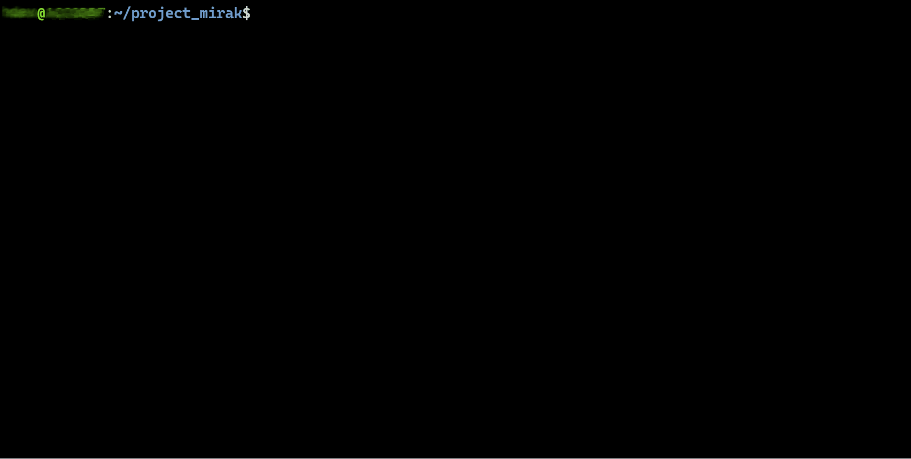
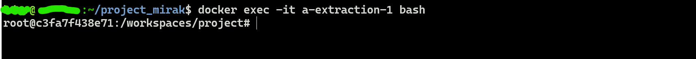
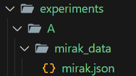
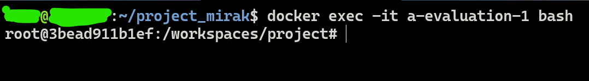
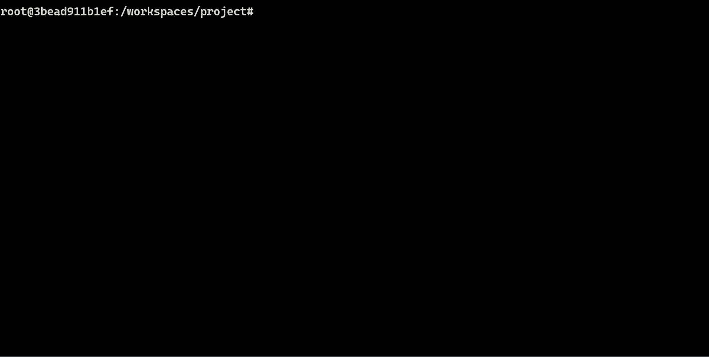
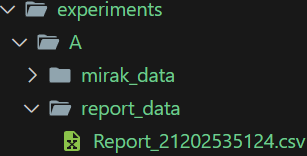

# MIRAK: Um Artefato para Robustecimento do Ambiente Relying Party RPKI

Este repositório está vinculado ao artigo "MIRAK: Um Artefato para Robustecimento do Ambiente Relying Party RPKI", de Melo, Y., Oliveira, F., Salles, R., Santos, A. e Moreno, H. O artigo foi enviado para publicação no Salão de Ferramentas do SBRC 2025.

Resumo do artigo: "O RPKI vem sendo discutido na literatura como principal forma de robustecimento do roteamento BGP. No entanto alguns trabalhos evidenciaram oportunidades de ataques ao próprio sistema de validação de rotas, justificando o esforço na resiliência desse ambiente. Este artigo apresenta o artefato MIRAK, que realiza de forma automatizada a identificação de vulnerabilidades conhecidas, contribuindo para reduzir o risco de ataques. Os resultados mostraram números animadores, motivando o investimento para aprimorar a sua eficiência". 

## Resumo

Resumo descrevendo o objetivo do artefato {Fala Yuri! Tem que completar este requisito.}


# Estrutura do Repositório

- [Selos considerados](#selos-considerados)
- [Informações básicas](#informações-básicas)
    - [Mirak-extractor](#mirak-extractor)
        - [Funcionalidades](#funcionalidades)
        - [Tecnologias utilizadas](#tecnologias-utilizadas)
        - [Requisitos mínimos de Hardware e Software](#requisitos-mínimos-de-hardware-e-software)
    - [Mirak-app](#mirak-app)
        - [Funcionalidades](#funcionalidades-1)
        - [Tecnologias utilizadas](#tecnologias-utilizadas-1)
        - [Requisitos mínimos de Hardware e Software](#requisitos-mínimos-de-hardware-e-software-1)
        - [Descrição dos campos do relatório em CSV](#descrição-dos-campos-do-relatório-em-csv)
  - [Acessar o código-fonte](#download-do-código-fonte)
- [Dependências](#dependências)
    - [Mirak-extractor](#mirak-extractor-1)
        - [Dependências Gerais](#dependências-gerais)
        - [Dependências para execução](#dependências-de-produção)
        - [Dependências de desenvolvimento e construção](#dependências-de-desenvolvimento-e-construção)
    - [Mirak-app](#mirak-app-1)
        - [Dependências Gerais](#dependências-gerais-1)
        - [Dependências para execução](#dependências-de-produção-1)
        - [Dependências de desenvolvimento e construção](#dependências-de-desenvolvimento-e-construção-1)
- [Preocupações com segurança](#preocupações-com-segurança)
- [Instalação](#instalação)
    - [Mirak-extractor](#mirak-extractor-2)
        - [Construção do pacote](#construção-do-pacote)
        - [Instalação do pacote](#instalação-do-pacote)
        - [Processo automatizado de construção e instalação](#processo-automatizado-de-construção-e-instalação)
        - [Remoção do pacote](#remoção-do-pacote)
    - [Mirak-app](#mirak-app-2)
        - [Construção do pacote](#construção-do-pacote-1)
            - [Tanspilação](#transpilação-typescript--javascript)
            - [Empacotamento](#construção-do-pacote-deb)
        - [Instalação do pacote](#instalação-do-pacote-1)
        - [Remoção do pacote](#remoção-do-pacote-1)
- [Teste mínimo](#teste-mínimo)
- [Uso individual das aplicações](#uso-individual-das-aplicações)
    - [Mirak-extractor](#mirak-extractor-3)
        - [Testando com Docker](#testando-com-docker)
          - [Cuidados antes de começar](#cuidados-antes-de-começar)
          - [Usando o Mirak-extractor no Docker](#usando-o-mirak-extractor-no-docker)
          - [Remover imagem e contêiner gerados](#remover-imagem-e-contêiner-gerados)
    - [Mirak-app](#mirak-app-3)
        - [Testando com Docker](#testando-com-docker-1)
          - [Cuidados antes de começar](#cuidados-antes-de-começar-1)
          - [Usando o Mirak-extractor no Docker](#-usando-o-mirak-app-no-docker-1)
          - [Remover imagem e contêiner gerados](#remover-imagem-e-contêiner-gerados-1)
- [Experimentos](#experimentos)
    - [Objetivo do experimento A](#objetivo-do-experimento-a)
    - [Objetivo do experimento B](#objetivo-do-experimento-b)
    - [Requisitos mínimos para executar o experimento](#requisitos-mínimos-para-executar-o-experimento)
    - [Procedimentos para os experimentos](#procedimentos-para-os-experimentos)
- [Licence](#license)

</br>

# Selos Considerados

Os autores consideram, para fins de avaliação, os seguintes selos: o selo D - Artefatos Disponíveis; o selo F - Artefatos Funcionais; e o selo R - Artefatos Reprodutíveis.  Para esse fim, este repositório disponibiliza códigos e scripts essenciais para a obtenção dos resultados em um ambiente simulado com Docker e Docker Compose.

</br>

---
# Informações básicas

Esta seção fornece informações fundamentais sobre todos os componentes necessários para a execução e replicação dos experimentos, incluindo a descrição completa do ambiente de execução, bem como os requisitos de hardware e software.

</br>

---
## Mirak-extractor

O Mirak-extractor é uma ferramenta prática e rápida que tem como objetivo diagnosticar as características do ecossistema hospedeiro Relying Party RPKI. É um sistema automatizado, que consegue avaliar uma grande quantidade de aplicações instaladas e configurações do ambiente em pouco tempo, gerando, ao final, um arquivo estruturado que permite análises futuras por outras aplicações, como o Mirak-app. Essa solução tem um pequeno impacto no ambiente de execução, uma vez que sua instalação e execução foram planejadas para consumir poucos recursos computacionais. Após a sua execução, o MIRAK-Extractor gera um arquivo estruturado denominado MIRAK, que contém as características do ambiente hospedeiro adequadas para a pesquisa de CVEs correspondentes.

</br>

### Funcionalidades

**Extração de informações**: De forma geral, o usuário fornece um caminho e o nome do arquivo, a partir do qual as informações do sistema operacional são extraídas de arquivos do sistema ou do usuário. Em seguida, inicia-se a identificação dos aplicativos instalados, armazenando suas principais características e identificadores. O processo também inclui a obtenção de informações sobre portas de rede, seguido pela exportação dos dados. A extração é baseada nas informações que caracterizam o sistema operacional, permitindo a seleção do algoritmo adequado para a identificação das aplicações. Para esse procedimento, são utilizados os seguintes arquivos, sendo necessário apenas um deles:

- os-release;
- lsb-release;
- issue.

Caso não sejam encontrados, o usuário é convidado a fornecer as informações necessárias para continuar com os procedimentos.

</br>

### Tecnologias utilizadas

O projeto utiliza as seguintes tecnologias e ferramentas:


#### **Linguagens e Runtime**

- **Python** – Linguagem de programação de alto nível, projetada para promover legibilidade e aumentar a produtividade.

#### **Frameworks e Bibliotecas**

- **Typer** – Framework para desenvolvimento de interfaces de linha de comando (CLI) em Python, baseado em Type Hints.

- **TQDM** – Biblioteca para exibição de barras de progresso em loops e processos iterativos.

- **Psutil** – Biblioteca que fornece informações sobre processos e o uso de recursos do sistema, como CPU e memória.

#### **Testes e Cobertura**

- **Pytest** – Framework de testes para Python, que simplifica a criação de testes unitários e funcionais.

- **Mock** – Ferramenta para a criação de mocks em testes, permitindo a simulação de objetos e comportamentos.

#### **Ferramentas de Qualidade e Formatação**

- **Flake8** – Ferramenta de análise estática para código Python que integra verificações de conformidade com a PEP 8, detecção de erros por meio do Pyflakes e avaliação da complexidade do código utilizando McCabe.

- **Black** – Formatador de código opinativo para Python, projetado para garantir um estilo consistente e padronizado, priorizando a legibilidade e a uniformidade do código.

- **Pylint** – Ferramenta de análise estática para código Python que identifica erros, avalia a conformidade com boas práticas de programação e sugere melhorias para a qualidade do código.

#### **Gerenciamento e Empacotamento**

- **Setuptools** – Ferramenta utilizada para o empacotamento e a distribuição de projetos em Python, fornecendo suporte para a gestão de dependências e a criação de pacotes instaláveis.

- **Wheel** – Formato de distribuição binária para pacotes Python, projetado para otimizar e agilizar o processo de instalação, reduzindo a necessidade de compilação durante a implementação.

</br>

### Requisitos mínimos de Hardware e Software

- Sistema operacional: 
  - Ubuntu 16.04 ou superior;
  - Debian 10 ou superior;
  - Red Hat Enterprise Linux 9.5 ou superior;
- Processador: 1 núcleo;
- Memória: 60 MB;
- Armazenamento: 1 MB.

</br>

---
## Mirak-app

Este software integra o projeto MIRAK, e tem como objetivo auxiliar os profissionais de gestão de tecnologia da informação ou cibersegurança a identificar possíveis vulnerabilidades que possam ser exploradas por ameaças, causando impacto nas operações de soluções RPKI. O Mirak-app é uma ferramenta de processamento e análise que visa simplificar como os profissionais fazem a avaliação de segurança de sistemas computacionais com função de Relying Party RPKI, através de uma operação automatizada que pode avaliar uma série de vulnerabilidades e cenários de risco com rapidez. Esta solução utiliza para a busca de CVEs o arquivo MIRAK, gerado pelo software Mirak-extractor. Este arquivo contém os detalhes funcionais do ambiente de execução, permitindo uma busca direcionada por CVEs específicas para o ambiente Relying Party.

</br>

### Funcionalidades

**Avaliação do ambiente de execução RPKI**: as informações contidas no arquivo MIRAK são utilizadas para analisar a segurança do ambiente onde o software validador RPKI está sendo executado. Inicialmente, realiza-se a verificação da integridade e correção dos identificadores CPE presentes no sistema. Em seguida, são identificadas vulnerabilidades conhecidas associadas ao software validador e ao sistema operacional. Com base nessa análise, avalia-se a aplicabilidade dessas vulnerabilidades ao ambiente identificado. Posteriormente, determina-se a relevância dos softwares detectados no contexto do RPKI, verificando também configurações de rede, como a presença de portas abertas. Por fim, os resultados da avaliação são exibidos e, caso vulnerabilidades sejam detectadas, um relatório detalhado é gerado para documentação e futuras ações corretivas.

</br>

### Tecnologias utilizadas

O projeto utiliza as seguintes tecnologias e ferramentas:

#### **Linguagens e Runtime**

- **Node.js**: (versão 12.0.0 ou superior) - Ambiente de execução assíncrono e orientado a eventos para JavaScript, baseado no motor V8 do Chrome, permitindo a construção de aplicações escaláveis e de alto desempenho.

- **TypeScript**: (versão 5.6.2 ou superior) - Superset do JavaScript que adiciona tipagem estática e recursos avançados, proporcionando maior robustez, manutenção e qualidade no desenvolvimento da aplicação.

#### **Frameworks e Bibliotecas**

- **Commander**: (versão 12.1.0) – Biblioteca para desenvolvimento de interfaces de linha de comando (CLI) em Node.js, facilitando a criação e o gerenciamento de comandos e argumentos.

- **Axios**: (versão 1.7.7) – Cliente HTTP baseado em Promises, projetado para a realização de requisições web assíncronas de forma eficiente e simplificada.

#### **Ferramentas de Qualidade e Produtividade**

- **ESLint**: (versão 9.11.1) – Ferramenta de linting para JavaScript que realiza a análise estática do código, garantindo conformidade com boas práticas e padrões estabelecidos.

- **Prettier**: (versão 3.3.3) – Formatador de código opinativo para JavaScript e outras linguagens, promovendo um estilo consistente e padronizado.

- **Husky**: (versão 9.1.6) – Ferramenta para gerenciamento de hooks do Git, permitindo a execução automática de verificações e validações antes da realização de commits e push.

- **Lint-staged**: (versão 15.2.10) – Executa verificações de código exclusivamente nos arquivos modificados no commit, otimizando o processo de linting e formatação.

#### **Ferramentas de Desenvolvimento**

- **Nodemon**: (versão 3.1.4) – Ferramenta para monitoramento de arquivos em projetos Node.js, permitindo a reinicialização automática da aplicação sempre que alterações são detectadas durante o desenvolvimento.

- **Dotenv**: (versão 16.4.7) – Biblioteca responsável por carregar variáveis de ambiente a partir de um arquivo .env, facilitando a configuração e o gerenciamento de credenciais e parâmetros da aplicação.

#### **Manipulação de Dados**

- **CSV-Writer**: (versão 1.6.0) – Biblioteca para a geração e escrita de arquivos no formato CSV, facilitando a exportação de dados estruturados.

- **JSONStream**: (versão 1.0.3) – Biblioteca otimizada para o processamento eficiente de grandes arquivos JSON por meio de streams, reduzindo o consumo de memória e melhorando o desempenho.

#### **Interface de Linha de Comando (CLI)**

- **CLI-Progress**: (versão 3.12.0) – Biblioteca para a exibição de barras de progresso em terminais, proporcionando um acompanhamento visual do progresso de operações em linha de comando.

- **Kleur**: (versão 4.1.5) – Biblioteca para estilização de saídas no terminal, permitindo a adição de cores e realces para melhor visualização das informações.

#### **Testes e Cobertura**

- **Jest**: (versão 29.7.0 ou superior) – Framework de testes para JavaScript, oferecendo suporte a mocks, spies e snapshots, permitindo a criação de testes automatizados eficientes e abrangentes.

- **Coverage**: (versão 6.1.1) – Ferramenta para análise da cobertura de código em testes, identificando quais trechos foram executados e auxiliando na validação da qualidade dos testes.

#### **Gerenciamento de Pacotes**

- **npm**: (versão 10.7.0 ou superior) – Gerenciador de pacotes oficial do Node.js, responsável pelo controle de dependências e automação de scripts de desenvolvimento.

#### **Ambiente virtualizado por contêiner**

- **Docker**: (versão 27.2.0 ou superior) – Plataforma para a criação, gerenciamento e execução de containers, facilitando a implantação e escalabilidade de aplicações em ambientes isolados.

</br>

### Requisitos mínimos de Hardware e Software

- Sistema operacional:
  - Ubuntu 20.04 ou superior;
- Processador: 1 núcleo;
- Memória: 140 MB;
- Rede: conexão de 10 Mbps;
- Armazenamento: 15 MB.

</br>

### Descrição dos campos do relatório CSV:

- **product** -> Define a nomenclatura atribuída ao software vulnerável conforme registrado na NVD (National Vulnerability Database);

- **vendor** -> Identifica o fabricante ou distribuidor responsável pelo software vulnerável;

- **type** -> Especifica se o software vulnerável corresponde a uma aplicação instalada ou a um componente integrante do sistema operacional;

- **version** -> Indica a versão específica do software que apresenta vulnerabilidades conhecidas;

- **cve_id** -> Código identificador da vulnerabilidade atribuído pela Mitre, servindo como referência oficial em sites, manuais e documentos técnicos;

- **description** -> Fornece uma descrição resumida da vulnerabilidade, destacando seus principais aspectos;

- **base_score** -> Valor numérico de 0 a 10 que representa a severidade da vulnerabilidade, conforme os critérios estabelecidos pelo padrão CVSS 3.1;

- **base_severity** -> Classificação textual correspondente ao base_score, conforme a seguinte tabela:

</br>

<div align="center">

| **Base Score** | **Gravidade**      |
|---------------|------------------|
| 0.0          | Sem impacto      |
| 0.1 - 3.9    | Baixa            |
| 4.0 - 6.9    | Média            |
| 7.0 - 8.9    | Alta             |
| 9.0 - 10.0   | Crítica          |

Fonte: [NVD - CVSS](https://nvd.nist.gov/vuln-metrics/cvss)

</div>

</br>

- **software_required**  ->  Indica se o software vulnerável é considerado essencial para o funcionamento do validador RPKI, excluindo o sistema operacional;

- **related_port** -> Identifica se uma porta de rede em estado de escuta está associada ao software vulnerável;

- **port_required** -> Especifica se funcionamento da solução RPKI depende da existência de portas de rede relacionadas ao software;

- **notes** -> Fornece informações adicionais sobre as portas de rede e seu possível impacto no desempenho e na segurança do validador RPKI.

</br>

### Acessar o código-fonte  

</br>

Faça o download do código-fonte acessando o repositório manualmente e selecionando as opções **Code** e, posteriormente, **Download ZIP**.

Após o download, extraia os arquivos para um diretório de sua preferência. Como alternativa, o download também pode ser realizado via wget ou curl. Certifique-se de que as ferramentas wget, curl e unzip estão previamente instaladas no sistema.

```bash
$ wget https://github.com/hugo-bm/SF25ArtigoMIRAK/archive/refs/heads/master.zip -O master.zip && unzip master.zip && cd SF25ArtigoMIRAK-master
```

</br>


---
# Dependências

Neste projeto, as dependências são divididas em dependências gerais, dependências de execução e dependências de desenvolvimento ou construção. As dependências de desenvolvimento ou construção são aquelas necessárias no contexto de desenvolvimento e construção. As dependências de execução, também conhecidas como dependências de produção, são as utilizadas pela aplicação em tempo de execução, ou seja, durante o seu funcionamento. As dependências gerais são aquelas essenciais para o funcionamento em todos os contextos apresentados anteriormente.

## Mirak-extractor

As dependências de produção são incorporadas durante o processo de empacotamento, eliminando a necessidade de instalação manual. Já as dependências de desenvolvimento são configuradas automaticamente por meio do script de instalação. Mais informações podem ser encontradas em [Processo automatizado de construção e instalação](#processo-automatizado-de-construção-e-instalação).

### Dependências gerais

- Python 3.8 ou superior

</br>

### Dependências de desenvolvimento e construção:

```bash
pytest >= 8.3.4
psutil >= 5.9.5
typer >= 0.15.1
mock >= 5.1.0
flake8 >= 7.1.1
black >= 24.8.0
pylint >= 3.2.7
wheel >= 0.34.2
tqdm >= 4.67.1
setuptools >= 45.2.0
```

</br>

O comando necessário para a instalação dessas dependências está apresentado a seguir.

```bash
$ pip install -r ./app/requirements_dev.txt
```

</br>

### Dependências de produção:

```bash
typer >= 0.15.1
psutil >= 5.9.5
tqdm >= 4.67.1
```

</br>

Para realizar a instalação, utilize o seguinte comando.

```bash
$ pip install -r ./app/requirements_prod.txt
```

</br>

## Mirak-app

### Dependências gerais

- Node.js 12.0.0 ou superior;
- Npm 10.7.0 ou superior;

A instalação dessas dependências está detalhada na documentação oficial do Node.js, disponível no seguinte link: [Node.js — Download Node.js®](https://nodejs.org/pt/download)

</br>

### Dependências para produção:

```json
{
  "ajv": "^8.17.1",
  "ajv-formats": "^3.0.1",
  "axios": "^1.7.7",
  "cli-progress": "^3.12.0",
  "commander": "^12.1.0",
  "csv-writer": "^1.6.0",
  "dotenv": "^16.4.7",
  "jsonstream": "^1.0.3",
  "kleur": "^4.1.5"
  }
```

</br>

A instalação pode ser efetuada utilizando o seguinte comando:

```bash
$ npm i --omit=dev
```

</br>

### Dependências de desenvolvimento e construção

```json
{
    "@eslint/js": "^9.11.1",
    "@types/cli-progress": "^3.11.6",
    "@types/jest": "^29.5.12",
    "@types/jsonstream": "^0.8.33",
    "@typescript-eslint/eslint-plugin": "^8.6.0",
    "@typescript-eslint/parser": "^8.6.0",
    "eslint": "^9.11.1",
    "eslint-config-google": "^0.14.0",
    "eslint-config-prettier": "^9.1.0",
    "eslint-plugin-prettier": "^5.2.1",
    "globals": "^15.10.0",
    "husky": "^9.1.6",
    "jest": "^29.7.0",
    "lint-staged": "^15.2.10",
    "nodemon": "^3.1.4",
    "prettier": "^3.3.3",
    "ts-jest": "^29.2.5",
    "ts-node": "^10.9.2",
    "typescript": "^5.6.2",
    "typescript-eslint": "^8.8.0"
  }
```

</br>

A instalação pode ser efetuada utilizando o seguinte comando:

```bash
$ npm install --include=dev
```

</br>

---
# Preocupações com segurança

O artefato MIRAK foi desenvolvido com o objetivo de ser minimamente invasivo, limitando-se à extração e processamento de informações sem realizar qualquer modificação nos arquivos do sistema. Dessa forma, sua utilização não representa riscos para os usuários que o analisarem.

</br>

---
# Instalação

## Mirak-extractor

Este processo envolve o **download do repositório**, **construção do pacote** e **instalação do pacote** gerado.

Para acessar o diretório que abriga o código, os scripts e o exemplo destinado ao Mirak-extractor, execute o comando a seguir.

```bash
cd mirak-extractor
```

### Construção do pacote

</br>

> **⚠️ Importante** Certifique-se de que todas as dependências de desenvolvimento e gerais estejam devidamente instaladas antes de prosseguir.

</br>

O processo de construção foi realizado utilizando "``setuptools``" para gerar um pacote no formato "``tar.gz``", destinado ao gerenciamento pelo "``PIP``". O PIP foi escolhido por ser o gerenciador de pacotes mais amplamente adotado e o padrão oficial para Python. A seguir, apresenta-se o comando utilizado para a criação do pacote:

```bash
$ python3 raiz_do_projeto/setup.py sdist
```

O pacote final será criado na diretório "``dist``".

</br>

**Demonstração:**

<div align="center">
  
</div>

</br>

### Instalação do pacote

</br>

Para instalar o Mirak-extractor, é essencial que uma versão compatível do Python esteja previamente instalada. O procedimento de instalação é descrito a seguir:

</br>

> **⚠️ Importante** O procedimento foi executado em um ambiente Ubuntu, utilizando ``python3.8``. Caso esteja utilizando uma versão diferente, substitua pelo comando correspondente à versão do Python instalada em seu ambiente.

</br>

1.	Primeiramente, é necessário atualizar o repositório e os pacotes do sistema operacional.

```bash
$ apt-get update

$ apt-get upgrade
```

</br>

2.	Posteriormente, a instalação deve ser realizada utilizando o seguinte comando:

```bash
$ python3.8 -m pip install ./dist/mirak-extractor-1.0.0.tar.gz
```

- Caso as dependências gerais não tenham sido previamente instaladas, a instalação do Python deve ser realizada conforme as instruções disponíveis neste [tutorial](https://python.org.br/instalacao-linux/)

</br>

3.	Para confirmar a conclusão bem-sucedida da instalação, execute o seguinte comando:

```bash
$ mirak-extractor --help
```

</br>

**Demonstração:**

<div align="center">
  
</div>

</br>

### Processo automatizado de construção e instalação

</br>

A pasta “``scripts``” contém códigos automatizados destinados à execução dos processos de instalação de dependências, construção do pacote e sua respectiva instalação. Estão disponíveis scripts específicos para cada sistema operacional compatível com o Mirak-extractor.

Para Debian ou Ubuntu:

```bash
$ source ./scripts/install_ubuntu_debian.sh
```

Para o Red Hat Enterprise Linux:

```sh
$ ./scripts/install_rhel.sh
```

</br>

Os scripts executam uma verificação das versões do **Python** instaladas no sistema e exibem as opções compatíveis. O usuário deverá selecionar a versão que será utilizada para o restante do processo. Caso nenhuma versão compatível seja encontrada, será solicitada a confirmação para a instalação do **Python 3.8**, considerado pelos autores o mais adequado para garantir a compatibilidade.

Desta forma, o usuário pode executar automaticamente os passos descritos nos itens **Construção do pacote** e **Instalação do pacote**.

</br>

**Demonstração:**

<div align="center">
  
</div>

</br>

### Remoção do pacote

</br>

Para remover o software, execute o seguinte comando:

```bash
$ pip uninstall mirak-extractor
```

Por fim, deve inserir o caractere "**Y**" para confirmar a exclusão.

Para remover a dependência ``Python``, caso tenha sido instalada juntamente com o software, utilize o comando de remoção apropriado para sua plataforma.

</br>

**Demonstração:**

<div align="center">
  
</div>

</br>

## Mirak-app

Este processo envolve o **download do repositório**, **construção do pacote** e **instalação do pacote** gerado.

Para acessar o diretório que abriga o código, os scripts e o exemplo destinado ao Mirak-extractor, execute o comando a seguir.

```bash
cd mirak-extractor
```

</br>

### Construção do pacote

</br>

> **⚠️ Importante:** Certifique-se de que o Node.js e o NPM estão devidamente instalados.

</br>

Antes de iniciar, é necessário garantir que todas as dependências de desenvolvimento estejam instaladas. Para isso, utilize o seguinte comando, caso ainda não tenha realizado a instalação:

```bash
$ npm install --include=dev
```

O processo de construção é composto por duas etapas principais: transpilação e empacotamento.

</br>

#### Transpilação (TypeScript → JavaScript)

</br>

Executar o processo de transpilação por meio do script automatizado denominado ``build``.

Exemplo: 

```bash
$ npm run build
```

Uma pasta denominada "``build``" será gerada, contendo o código preparado para execução em um ambiente de produção.


</br>


#### Empacotamento (.deb)

</br>

O processo de empacotamento deve ser executado por meio do script automatizado "``packaging.sh``", localizado no diretório "``script``".

```bash
$ source ./packaging.sh
```

O pacote será gerado no diretório "dist".

</br>

**Demonstração da transpilação e do empacotamento:**

<div align="center">
  
</div>

</br>

### Instalação do pacote

</br>

Atualmente, a solução foi portada exclusivamente para distribuições baseadas em Debian, como o Ubuntu. Para prosseguir, é indispensável uma conexão com a internet. O procedimento está detalhado a seguir:

</br>

> **⚠️ Importante:** O procedimento foi feito usando o Ubuntu.

</br>

1.  Inicialmente, deve-se realizar a atualização do repositório e dos pacotes instalados.

```bash
$ apt update

$ apt upgrade
```

</br>

2.  Posteriormente, a instalação deve ser realizada utilizando o comando indicado a seguir.

```bash

$ apt install ./dist/mirak-app.deb

```

 - Caso as dependências não tenham sido previamente instaladas, será solicitada a confirmação para proceder com a instalação. Para confirmar, insira "**Y**".

 </br>

3.  Para confirmar se a instalação foi concluída corretamente, execute o seguinte comando:

```bash
$ mirak-app -V
```

</br>

**Demonstração da atualização e instalação:**

<div align="center">
  
</div>

</br>

</br>

4. Todas as configurações do aplicativo são feitas em variáveis de ambiente ou em um arquivo “``.env``”. Para facilitar o processo de configuração, pode ser utilizado o comando a seguir:

</br>

>  **❗ Aviso:** Para garantir o funcionamento adequado, é necessário o uso de uma ``Chave de API`` da NVD. A utilização da chave viabiliza um fluxo mais robusto de requisições, contribuindo para a redução do tempo de execução do Mirak-app. Esta chave pode ser adquirida [clicando aqui](https://nvd.nist.gov/developers/request-an-api-key).

</br>

```bash
$ cat > /opt/mirak-app/.env <<EOL
API_NVD_KEY="Coloque_aqui_sua_chave_da_NVD"
EOL
```

</br>

**Demonstração da configuração do Mirak-app:**

<div align="center">
  
</div>

</br>

### Remoção do pacote

</br>

Para realizar a remoção, basta executar os comandos a seguir:

```bash
$ apt remove mirak-app
```

Por fim, deve inserir o caractere "**Y**" para confirmar a exclusão.

</br>

**Demonstração:**

<div align="center">
  
</div>

</br>

</br>

Caso as dependências Node.js e NPM tenham sido instaladas juntamente com o aplicativo, o processo de remoção não as excluirá automaticamente. Para removê-las, execute o seguinte comando:

```bash
$ apt autoremove
```

Por fim, deve inserir o caractere "**Y**" para confirmar a exclusão.

</br>

> **⚠️ Importante:** O comando "`apt autoremove`" desinstala qualquer dependência órfãs. No entanto, caso uma dependência esteja em uso por outra aplicação, ela não será desinstalada.

</br>

---
# Teste mínimo

A realização de um teste básico de execução permite que os revisores avaliem as funcionalidades do artefato e confirmem seu correto funcionamento. Esse procedimento é fundamental para a identificação de eventuais problemas durante a instalação, garantindo que o artefato tenha sido corretamente instalado. Para verificar se o Mirak-app foi instalado corretamente e se seu binário está operando adequadamente, utilize o seguinte comando:

```bash
$ mirak-app --help
```

A opção "``--help``" exibe uma descrição sucinta sobre o funcionamento do aplicativo.

</br>

Da mesma forma, para verificar a instalação e o funcionamento do Mirak-extractor, execute o seguinte comando:

```bash
$ mirak-extractor --help
```

</br>

---
# Uso individual das aplicações

## Mirak-extractor

</br>

Após a instalação, a aplicação pode ser executada digitando "``mirak-extractor``". 

Como a aplicação possui um único propósito, não há suporte para comandos CLI adicionais. Para utilizá-la, é necessário especificar a opção "--output", indicando o caminho relativo para o destino do arquivo, incluindo seu nome e a extensão “.json”, conforme ilustrado no exemplo abaixo:

```bash
$ mirak-extractor --output caminho_arquivo_mira/nome_do_arquivo.json
```

</br>

> **💡 Dica** Existe também a opção "**``--help``**" que imprime uma explicação sucinta do funcionamento.

</br>

Se nenhuma opção for especificada, o arquivo será exportado para o diretório a partir do qual a aplicação foi executada.

</br>

**Demonstração:**

<div align="center">
  
</div>

</br>

---
## Testando com Docker

</br>

O ``mirak-extractor`` pode ser executado em um ambiente Docker, permitindo sua utilização sem a necessidade de instalação direta no sistema. Essa abordagem facilita a configuração de um ambiente isolado de maneira eficiente, garantindo que todos os requisitos sejam atendidos.

</br>

> **⚠️ Importante:** Os exemplos apresentados a seguir foram elaborados com base no Ubuntu. No entanto, podem ser necessárias pequenas adaptações para outras distribuições compatíveis.

</br>

### Cuidados antes de começar

</br>

> **❗ Aviso:** Os comandos a seguir fazem o uso de permissões privilegiadas. Certifique-se de rodar esses comandos como **superusuário** para evitar problemas de permissão.

</br>

Antes de iniciar, é necessário garantir que o **Docker daemon** esteja em execução. Para verificar seu status, utilize o seguinte comando:

```bash
$ sudo service docker status
```

ou

```bash
$ sudo systemctl status docker
```

Se o serviço estiver desativado, utilize os seguintes comandos para iniciá-lo:

```bash
$ sudo service docker start
```

ou

```bash
$ sudo systemctl enable docker.service
$ sudo systemctl enable containerd.service
```

Para mais informações, acesse a documentação oficial através do link: [Documentação oficial do Docker](https://docs.docker.com/engine/install/)

</br>

### Usando o Mirak-extractor no Docker

</br>

> **⚠️ Importante**  O tutorial a seguir foi desenvolvido com base no Ubuntu. Para garantir a compatibilidade com o RHEL, algumas etapas podem necessitar de ajustes mínimos.

</br>

Primeiramente, é necessário criar um diretório no host denominado "``output``", que será utilizado para armazenar o arquivo MIRAK no formato JSON. Para realizar essa etapa, execute o seguinte comando:

```bash
$ mkdir output
```

</br>

Na etapa seguinte, será realizada a construção da imagem. Certifique-se de que está no diretório raiz do projeto, onde está localizado o arquivo "**``dockerfile.example``**". Em seguida, execute o comando abaixo para iniciar o processo de construção da imagem:

```bash
$ docker build -f 'dockerfile.example' -t mirak-extractor-image .
```

</br>

Nesta etapa, será realizada a construção e a execução de um contêiner contendo o ambiente de execução necessário para este exemplo.

```bash
$ docker run -dit --name mirak-extractor-container -v $(pwd)/output:/workspaces/project/output  mirak-extractor-image
```

</br>

Essa etapa é essencial, pois será estabelecida a conexão com o terminal do contêiner. Para isso, execute o seguinte comando:

```bash
$ docker exec -it mirak-extractor-container bash
```

</br>

Neste momento, a conexão com o terminal do contêiner deve estar estabelecida. O próximo passo consiste na execução dos seguintes comandos para inicializar o **Routinator**:

```bash
$ routinator init --accept-arin-rpa -f 

$ routinator server --http 0.0.0.0:8323 --rtr 0.0.0.0:3323 --http 0.0.0.0:9556 -d
```

</br>

Na próxima etapa, serão aplicados os procedimentos descritos em **Construção do Pacote** e **Instalação do Pacote** para concluir o processo de instalação. Neste exemplo, será demonstrado o uso do script para a instalação automatizada das dependências e do Mirak-extractor. Para isso, execute o seguinte script:

```bash
$ source ./scripts/install_ubuntu_debian.sh
```

</br>

Neste exemplo, não há uma instalação prévia do Python, portanto, será solicitada a confirmação para proceder com a instalação. Responda digitando no console o caractere "``y``". Vale ressaltar que o mesmo deve estar em minúsculo.

</br>

Após a instalação do Python, será solicitada a seleção da versão do software a ser utilizada para a construção e instalação do aplicativo.  

Para prosseguir, insira o numeral "``1``" no console, selecionando a versão instalada compatível.

</br>

Após a conclusão do processo, o aplicativo estará disponível para uso ao executar “mirak-extractor” no console. Por fim, será necessário executar o comando especificando o caminho para o diretório ``output``. Esse diretório é essencial, pois está "espelhado" com a pasta output no host. Dessa forma, o arquivo gerado no contêiner será automaticamente copiado para o diretório correspondente no host, permitindo seu uso posterior. Para prosseguir, execute o seguinte comando no console:

```bash
$ mirak-extractor --output output/mirak.json
```

</br>

Após a conclusão do processo, uma notificação informará a localização do arquivo gerado. Para verificar, execute o seguinte comando:

```bash
$ ls output
```

</br>

Agora, será possível visualizar um arquivo com a extensão "``.json``" criado no diretório especificado. Para encerrar a conexão com o contêiner, digite "``exit``" no console. Em seguida, estando no ``host``, execute o seguinte comando:

```bash
$ cat output/mirak.json
```

</br>

**O conteúdo do arquivo será exibido na tela! Parabéns, você executou o processo deste exemplo com sucesso!**

</br>

### Remover imagem e contêiner gerados

</br>

Caso seja necessário remover a imagem e o contêiner Docker gerados neste exemplo, execute os seguintes comandos:

```bash
# Parar a execução do contêiner

$ docker stop mirak-extractor-container

# Deletar o contêiner

$ docker rm mirak-extractor-container

# Remover a imagem 

$ docker image rm mirak-extractor-image
```

</br>

## Mirak-app

</br>

Após a instalação, o aplicativo pode ser executado digitando “mirak-app” no console.  A aplicação dispõe de dois comandos principais: "``evaluate``" e "``help``". O comando "``help``" exibe uma descrição detalhada sobre o funcionamento da aplicação.

```bash
$ mirak-app help
```

</br>

O comando ``evaluate`` executa a funcionalidade principal da aplicação e pode ser utilizado com ou sem exibição de informações na tela. Recomenda-se fortemente o uso da opção "**-v**", permitindo que o processo apresente detalhes sobre sua execução. A seguir, é apresentado um exemplo de utilização:

```bash
$ mirak-app evaluate -v ./caminho_até_o_arquivo_mirak/mirak.json ./pasta_de_saída
```

</br>

**Demonstração:**

<div align="center">
  
</div>

</br>

## Testando com Docker

</br>

O `Mirak-app` pode ser executado em um ambiente Docker, eliminando a necessidade de instalação direta no sistema. Essa abordagem possibilita a configuração rápida de um ambiente isolado, assegurando o cumprimento de todos os requisitos necessários.

</br>

> **⚠️ Importante:** Os exemplos a seguir foram desenvolvidos com base no Ubuntu. No entanto, podem ser necessárias pequenas adaptações para outras distribuições compatíveis.

</br>

### Cuidados antes de começar

</br>

> **❗ Aviso:** Os comandos a seguir fazem o uso de permissões privilegiadas. Certifique-se de rodar esses comandos como **superusuário** para evitar problemas de permissão.

</br>

Antes de iniciar, é necessário garantir que o **Docker daemon** esteja em execução. Para verificar seu status, utilize o seguinte comando:

```bash
$ sudo service docker status
```

ou

```bash
$ sudo systemctl status docker
```

</br>

Se o serviço estiver desativado, utilize os seguintes comandos para iniciá-lo:

```bash
$ sudo service docker start
```

ou

```bash
$ sudo systemctl enable docker.service
$ sudo systemctl enable containerd.service
```

</br>

Para obter mais informações, consulte a documentação oficial no seguinte link: [Documentação oficial do Docker](https://docs.docker.com/engine/install/)

</br>

### Usando o Mirak-app no Docker

</br>

Primeiramente, é necessário criar dois diretórios no host: "``input``" e "``output``". O diretório"``input``" será utilizado para armazenar o arquivomirak.json, enquanto o diretório "``output``" conterá o relatório final no formato CSV. Para executar essa etapa, utilize o seguinte comando:

```bash
$ mkdir input output
```

</br>

O arquivo mirak.json deve ser colocado no diretório input, conforme ilustrado na imagem a seguir.

<div align="center">
  
</div>

</br>

Em seguida, será realizada a construção do pacote contendo o Mirak-app. Para executar esse processo, utilize os seguintes comandos:

```bash
$ npm run build # Para realizar a transpilação
$ source ./packaging.sh # Para realizar  o processo de empacotamento
```

</br>

Na etapa seguinte, será realizada a construção da imagem. Certifique-se de que está no diretório raiz do projeto, onde o arquivo "``Dockerfile``" está localizado. Em seguida, execute o comando abaixo para iniciar o processo de construção da imagem:

```bash
$ docker build -t mirak-app-image .
```

</br>

Nesta etapa, será realizada a construção e a execução de um contêiner contendo o ambiente de execução necessário para este exemplo.

```bash
$ docker run -dit \
    --name mirak-app-container \
    -v $(pwd)/output:/app/output \
    -v $(pwd)/input:/app/input \
    mirak-app-image
```

</br>

Esta etapa é fundamental, pois será estabelecida a conexão com o terminal do contêiner. Para isso, execute o seguinte comando:

```bash
$ docker exec -it mirak-app-container bash
```

</br>

Agora, com o console conectado ao contêiner, prossiga com as etapas a seguir para concluir a instalação e a configuração da ferramenta.

</br>

> **❗ Aviso:** Para garantir o funcionamento adequado, é necessário o uso de uma ``Chave de API`` da NVD. A utilização da chave viabiliza um fluxo mais robusto de requisições, contribuindo para a redução do tempo de execução do Mirak-app. Esta chave pode ser adquirida [clicando aqui](https://nvd.nist.gov/developers/request-an-api-key).

</br>

```bash
# Atualizar os repositórios do Sistema Operacional
$ apt update 

# Instalar o pacote e dependencias
$ apt install ./dist/mirak-app.deb 

# Digite Y para instalar as dependências

# Testar a instalação do Mirak-app
$ mirak-app -V 

# Realizar a configuração do Mirak-app
$ cat > /opt/mirak-app/.env <<EOL 
API_NVD_KEY="digite sua chave aqui"
EOL
```

</br>

Para executar a aplicação, utilize o seguinte comando: 

```bash
$ mirak-app evaluate -v ./input/mirak.json ./output
```

</br>

Por fim, para retornar ao host, utilize o comando "exit". O relatório em formato CSV estará disponível no diretório "output".


<div align="center">
  
</div>

</br>

### Remover imagem e contêiner gerados

</br>

Caso seja necessário remover a imagem e o contêiner **Docker** criados neste exemplo, execute os seguintes comandos:

```bash
# Parar a execução do contêiner
$ docker stop mirak-app-container

# Deletar o contêiner
$ docker rm mirak-app-container

# Remover a imagem 
$ docker image rm mirak-app-image
```

</br>

---
# Experimentos

</br>

> **⚠️ Importante** Para esses experimentos, será utilizada a versão 20.04 do Ubuntu. Nenhuma modificação será realizada no sistema, garantindo a homogeneidade do ambiente e permitindo uma comparação mais precisa.

</br>

Esta seção apresenta um passo a passo detalhado para a execução do procedimento e a obtenção dos resultados descritos no artigo, permitindo que os revisores validem as afirmações apresentadas. Para demonstrar o potencial do projeto, foram definidos dois experimentos a serem conduzidos em uma infraestrutura virtualizada.

### Requisitos mínimos para executar o experimento

</br>

> **💡Dica** É recomendado executar um experimento de cada vez para um melhor desempenho.

</br>

- CPU: 3 vCPUs
- RAM: 3 GB
- Armazenamento: 20 GB
- Rede: 100 Mbps+


### Descrição

O projeto Mirak é estruturado em duas etapas principais: extração de dados e avaliação dos dados. Para cada etapa, um contêiner específico é disponibilizado, proporcionando um ambiente isolado e controlado. Os resultados de cada etapa são armazenados em diretórios dedicados, permitindo a transferência dos artefatos do ambiente isolado para o host. Esse processo garante a execução segura e controlada, facilitando a análise dos dados e a obtenção dos resultados de maneira eficiente.

#### Objetivo do Experimento A

Para testar o funcionamento desta versão do artefato, foram criadas imagens em Docker para recriar um mesmo ambiente operacional em duas situações distintas. No experimento “A”, um validadorRoutinator 0.9.0-rc3 desatualizado foi introduzido em uma máquina virtual hospedeira. O objetivo é avaliar se o artefato consegue listar as vulnerabilidades específicas conhecidas dessa versão do Relying Party Routinator.

#### Objetido Experimentonto B

No experimento “B”, outra versão do validador Routinator 0.14.0-rc3, sem vulnerabilidades CVEs relatadas na NVD, foi introduzido no mesmo ambiente hospedeiro do experimento “A”.

### Procedimentos para os experimentos

Os comandos serão descritos por etapas. Iniciando com a etapa de "extração de dados" e finalizando com a etapa de "avaliação de dados". Os comandos que se diferem entre os experimentos serão apresentados ambos e os mesmos sinalizados para melhor compreensão.


</br>

> **⚠️ Importante** Antes de iniciar, certifique-se de que o Docker está instalado e em execução. Caso ainda não tenha realizado a instalação, consulte o seguinte tutorial: [Install | Docker Docs](https://docs.docker.com/engine/install/).

</br>

> **💡Dica** Algumas versões mais antigas do Docker Compose apresentam o inicio do comando utilizando hífen no lugar de espaço em branco ("``docker-compose``").

</br>

O primeiro passo consiste na execução do comando para iniciar o Docker Compose, conforme apresentado abaixo:

</br>

Para o experimento **A**

```bash
$ docker compose -f 'experiments/A/docker-compose.yaml' up -d --build
```


Para o experimento **B**

```bash
$ docker compose -f 'experiments/B/docker-compose.yaml' up -d --build
```

</br>

**Demonstração:** 

<div align="center">
  
</div>

</br>


### Extraindo as informações

</br>

Agora iniciaremos a etapa de extração de dados. Para isso, é necessário estabelecer a conexão com o terminal do contêiner que executa o ambiente da solução RPKI, utilizando o seguinte comando:


Para o experimento **A**

```bash
$ docker exec -it a-extraction-1 bash
```


Para o experimento **B**

```bash
$ docker exec -it b-extraction-1 bash
```

</br>

**Demonstração:**

<div align="center">
  
</div>

</br>

</br>

Neste estágio, já estamos no ambiente da solução RPKI. Agora, é necessário proceder com a instalação do software ``Mirak-extractor`` por meio do seguinte comando:

```bash
$ source ./scripts/install_ubuntu_debian.sh
```

</br>

Para garantir a instalação correta do artefato, selecione a opção "``1``".

</br>

**Demonstração:**

<div align="center">
  
</div>

</br>

</br>

Com o artefato devidamente instalado, sua execução pode ser realizada digitando "``mirak-extractor``" no terminal, conforme ilustrado abaixo:

```bash
$ mirak-extractor --output ./output/mirak.json
```

</br>

> **💡 Dica** A opção "**``--help``**" pode ser utilizada para exibir uma descrição resumida do funcionamento da aplicação.

</br>

**Demonstração:**

<div align="center">
  
</div>

</br>

</br>

O resultado foi armazenado no diretório ``output`` dentro do ambiente e, automaticamente, copiado para a pasta ``mirak_data`` no host.


Demonstração da saída para o experimento A:

<div align="center">
  
</div>

</br>

Neste estágio, o uso deste contêiner está concluído. Para retornar ao host, execute o comando ``exit``.

</br>

### Avaliando as informações

</br>

Inicia-se agora a etapa de avaliação de dados. Para isso, é necessário estabelecer a conexão com o terminal do contêiner que contém o ambiente adequado para a execução da avaliação.


Para o experimento **A**

```bash
$ docker exec -it a-evaluation-1 bash
```

</br>

Para o experimento **B**

```bash
$ docker exec -it b-evaluation-1 bash
```

</br>

**Demonstração:**

<div align="center">
  
</div>


</br>

</br>

Nesta etapa, será realizada a preparação para a construção e o empacotamento do **Mirak-app**, utilizando o seguinte comando:


</br>


```bash
$ npm install --include=dev
```

</br>

**Demonstração:**

<div align="center">
  
</div>

</br>

</br>

Neste estágio, será realizado o processo de construção do pacote para a instalação do artefato. Esse processo ocorre de forma automatizada por meio de dois scripts, conforme descrito a seguir:

- Script build: Responsável pela transpilação do código TypeScript para JavaScript. Além disso, executa um conjunto de testes unitários para assegurar a confiabilidade e a integridade do artefato.

    Comando a ser utilizado: 

    ```bash
    $ npm run build
    ```

- Script packaging.sh: Responsável pela criação do pacote para distribuições baseadas em Debian, como o Ubuntu. Essa etapa tem como objetivo facilitar o uso, a instalação e a remoção do artefato. Ao término do processo, o pacote de instalação será gerado no diretório ``dist``.

    Comando a ser utilizado:

    ```bash
    $ source ./script/packaging.sh
    ```

</br>

**Demonstração:**

<div align="center">
  
</div>

</br>

</br>

Agora, será realizada a instalação e configuração do ``mirak-app``. Ao concluir o processo, o software estará disponível para execução por meio do comando **`mirak-app`** no terminal.

A seguir, são apresentados os comandos para atualização dos repositórios e dos pacotes do ambiente:

```bash
$ apt update
$ apt upgrade
```

Comando para instalar:

```bash
$ apt install ./dist/mirak-app.deb
```

</br>

**Demonstração:**

<div align="center">
  
</div>

</br>

</br>

Comando para configurar:

</br>

> **❗ Aviso:** Para garantir o funcionamento adequado, é necessário o uso de uma ``Chave de API`` da NVD. A utilização da chave viabiliza um fluxo mais robusto de requisições, contribuindo para a redução do tempo de execução do Mirak-app. Esta chave pode ser adquirida [clicando aqui](https://nvd.nist.gov/developers/request-an-api-key).

</br>

```bash
$ cat > /opt/mirak-app/.env <<EOL
API_NVD_KEY="Coloque_aqui_sua_chave_da_NVD"
EOL
```

</br>

Por fim, a avaliação será iniciada utilizando o comando ``evaluate`` do Mirak-app. Para isso, execute os seguintes comandos:

```bash
$ mirak-app evaluate -v ./input/mirak.json ./output
```

</br>

**Demonstração:**

<div align="center">
  
</div>

</br>

</br>

A duração do processo pode variar, estimando-se aproximadamente 28 minutos. Ao término da execução, a saída esperada será semelhante à seguinte:

<div align="center">
  
</div>

</br>

---
# LICENSE

</br>

Leia as informações escritas no arquivo [LICENSE](./LICENSE)