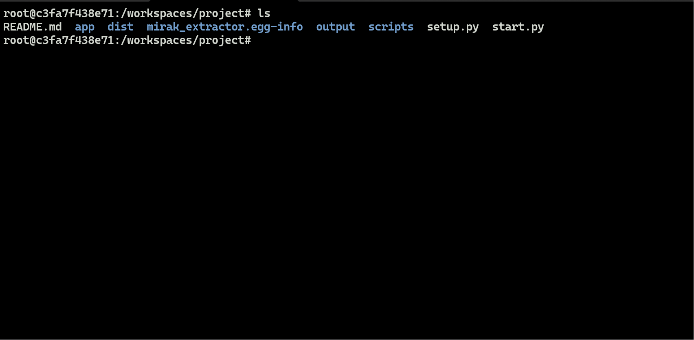
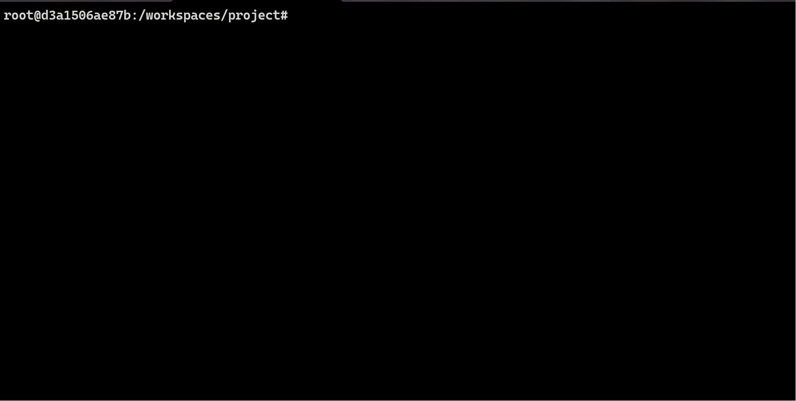
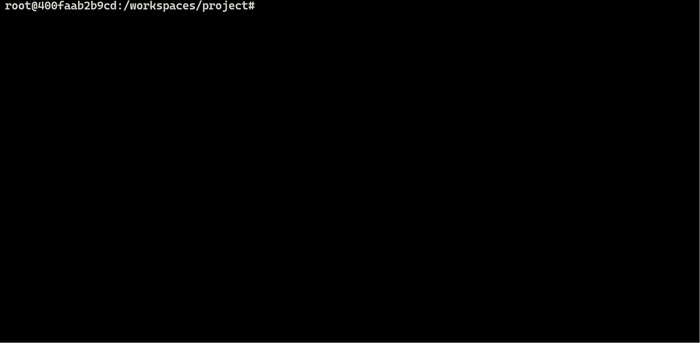
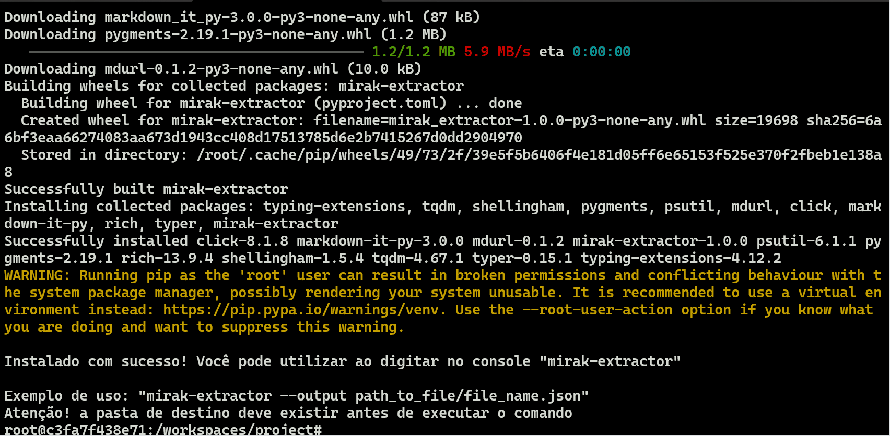
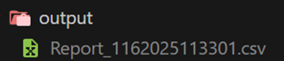
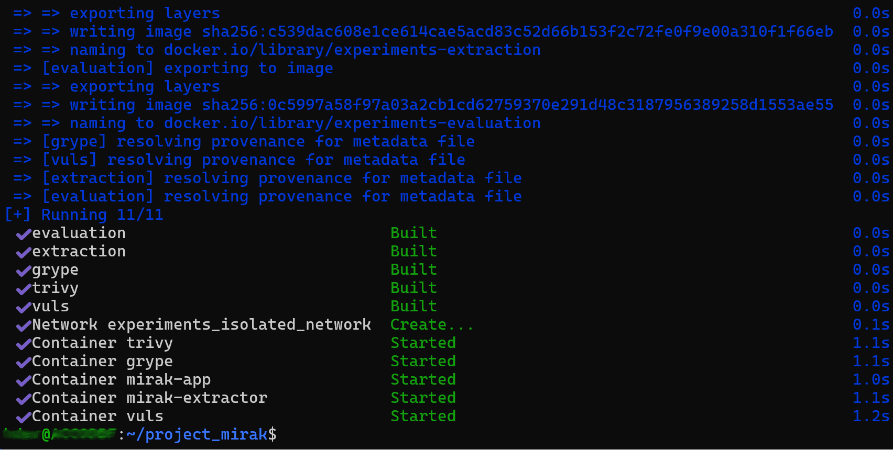
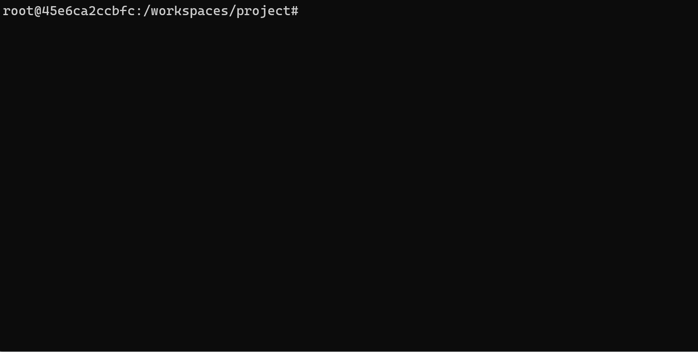
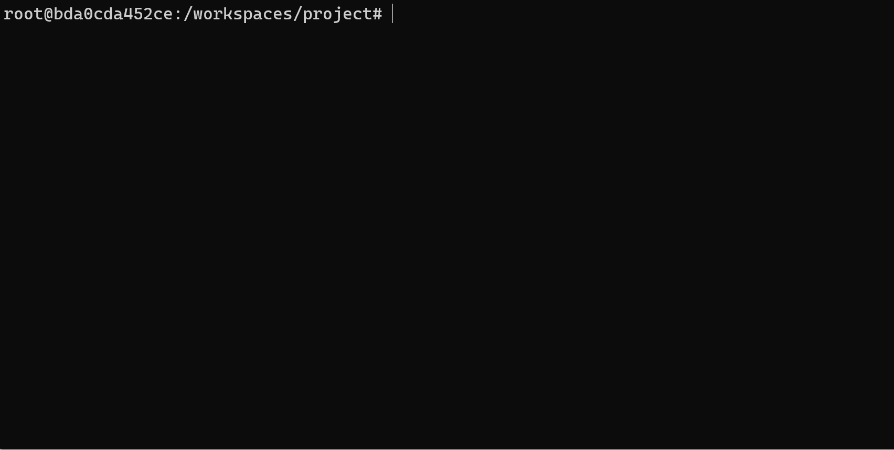
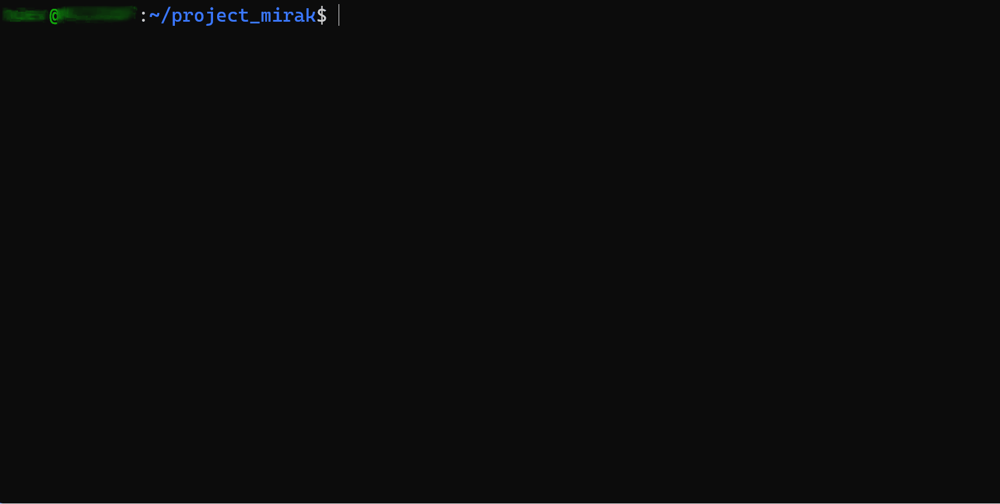

# MIRAK: Um Artefato para Robustecimento do Ambiente Relying Party RPKI

Este repositório está vinculado ao artigo "MIRAK: Um Artefato para Robustecimento do Ambiente Relying Party RPKI", de Melo, Y., Oliveira, F., Salles, R., Santos, A. e Moreno, H. O artigo foi enviado para revisão dos pares na trilha principal do Simpósio Brasileiro de Cibersegurança (SBSeg) 2025.

# Resumo

A validação de rotas através do Routinator e o protocolo RPKI vem sendo discutidos na literatura como a principal combinação para o robustecimento do roteamento BGP. No entanto, alguns trabalhos evidenciaram oportunidades de ataques ao próprio sistema validador de rotas, justificando o esforço no aumento da resiliência dessa solução. Este artigo apresenta a aplicação MIRAK, desenvolvida com técnicas próprias para baixo consumo de recursos e rapidez, que realiza de forma automatizada a identificação de vulnerabilidades no Routinator, contribuindo para reduzir o risco de ataques. Os resultados iniciais se mostraram animadores, motivando o estudo para aprimorar a sua eficiência e amplitude.


# Estrutura do Repositório

- [MIRAK: Um Artefato para Robustecimento do Ambiente Relying Party RPKI](#mirak-um-artefato-para-robustecimento-do-ambiente-relying-party-rpki)
- [Resumo](#resumo)
- [Estrutura do Repositório](#estrutura-do-repositório)
- [Informações básicas](#informações-básicas)
  - [Mirak-extractor](#mirak-extractor)
    - [Tecnologias utilizadas](#tecnologias-utilizadas)
      - [**Linguagens e Runtime**](#linguagens-e-runtime)
      - [**Frameworks e Bibliotecas**](#frameworks-e-bibliotecas)
      - [**Testes e Cobertura**](#testes-e-cobertura)
      - [**Ferramentas de Qualidade e Produtividade**](#ferramentas-de-qualidade-e-produtividade)
      - [**Gerenciamento e Empacotamento**](#gerenciamento-e-empacotamento)
    - [Requisitos mínimos de Hardware e Software](#requisitos-mínimos-de-hardware-e-software)
  - [Mirak-app](#mirak-app)
    - [Tecnologias utilizadas](#tecnologias-utilizadas-1)
      - [**Linguagens e Runtime**](#linguagens-e-runtime-1)
      - [**Frameworks e Bibliotecas**](#frameworks-e-bibliotecas-1)
      - [**Ferramentas de Qualidade e Produtividade**](#ferramentas-de-qualidade-e-produtividade-1)
      - [**Ferramentas de Desenvolvimento**](#ferramentas-de-desenvolvimento)
      - [**Manipulação de Dados**](#manipulação-de-dados)
      - [**Interface de Linha de Comando (CLI)**](#interface-de-linha-de-comando-cli)
      - [**Testes e Cobertura**](#testes-e-cobertura-1)
      - [**Gerenciamento de Pacotes**](#gerenciamento-de-pacotes)
      - [**Ambiente virtualizado por contêiner**](#ambiente-virtualizado-por-contêiner)
    - [Requisitos mínimos de Hardware e Software](#requisitos-mínimos-de-hardware-e-software-1)
    - [Descrição dos campos do relatório CSV](#descrição-dos-campos-do-relatório-csv)
- [Acesso ao código-fonte](#acesso-ao-código-fonte)
- [Dependências](#dependências)
  - [Mirak-extractor](#mirak-extractor-1)
    - [Dependências gerais](#dependências-gerais)
    - [Dependências de desenvolvimento e construção](#dependências-de-desenvolvimento-e-construção)
    - [Dependências de produção](#dependências-de-produção)
  - [Mirak-app](#mirak-app-1)
    - [Dependências gerais](#dependências-gerais-1)
    - [Dependências de desenvolvimento e construção](#dependências-de-desenvolvimento-e-construção-1)
    - [Dependências para produção](#dependências-para-produção)
- [Preocupações com segurança](#preocupações-com-segurança)
- [Instalação](#instalação)
  - [Mirak-extractor](#mirak-extractor-2)
    - [Construção do pacote](#construção-do-pacote)
    - [Instalação do pacote](#instalação-do-pacote)
    - [Processo automatizado de construção e instalação](#processo-automatizado-de-construção-e-instalação)
    - [Remoção do pacote](#remoção-do-pacote)
  - [Mirak-app](#mirak-app-2)
    - [Construção do pacote](#construção-do-pacote-1)
      - [Transpilação (TypeScript → JavaScript)](#transpilação-typescript--javascript)
      - [Empacotamento (.deb)](#empacotamento-deb)
    - [Instalação do pacote](#instalação-do-pacote-1)
    - [Remoção do pacote](#remoção-do-pacote-1)
- [Teste mínimo](#teste-mínimo)
- [Uso individual das aplicações](#uso-individual-das-aplicações)
  - [Mirak-extractor](#mirak-extractor-3)
  - [Testando com Docker](#testando-com-docker)
    - [Verificações iniciais](#verificações-iniciais)
    - [Usando o Mirak-extractor no Docker](#usando-o-mirak-extractor-no-docker)
    - [Remover imagem e contêiner gerados](#remover-imagem-e-contêiner-gerados)
  - [Mirak-app](#mirak-app-3)
  - [Testando com Docker](#testando-com-docker-1)
    - [Usando o Mirak-app no Docker](#usando-o-mirak-app-no-docker)
    - [Remover imagem e contêiner gerados](#remover-imagem-e-contêiner-gerados-1)
- [Experimentos](#experimentos)
  - [Requisitos mínimos para executar o experimento](#requisitos-mínimos-para-executar-o-experimento)
  - [Descrição](#descrição)
    - [Versões dos Softwares utilizados no experimento](#versões-dos-softwares-utilizados-no-experimento)
    - [Versões do routinator suportadas atualmente pelo ambiente virtual](#versões-do-routinator-suportadas-atualmente-pelo-ambiente-virtual)
  - [Iniciando e finalizando o ambiente virtual](#iniciando-e-finalizando-o-ambiente-virtual)
  - [Grype](#grype)
  - [Trivy](#trivy)
  - [Vuls](#vuls)
  - [Mirak](#mirak)
- [Reivindicações](#reivindicações)
- [LICENSE](#license)

</br>

---
# Informações básicas

Esse repositório contém o artefato MIRAK, que inclui duas aplicações – Mirak-extractor e Mirak-app – além de um *script* automatizado para a criação de ambientes virtuais, visando a facilitar a reprodução dos experimentos. Adicionalmente, o repositório detalha os requisitos mínimos necessários para a execução das aplicações.

</br>

---
## Mirak-extractor

O Mirak-extractor é uma ferramenta que diagnostica as características do ambiente hospedeiro *Relying Party RPKI*. É um sistema automatizado, identificando as aplicações instaladas e detalhes operacionais do ambiente em pouco tempo, gerando o arquivo MIRAK, que permite análises por outras aplicações, como o Mirak-app. Foi desenvolvido em Python com o uso do padrão Singleton, com baixo impacto em requisitos para instalação e execução. O arquivo MIRAK contém, ao final da execução do Mirak-extractor todas as características do ambiente hospedeiro necessárias para a pesquisa de CVEs correspondentes. Em sua versão atual, oferece suporte aos principais sistemas operacionais utilizados pelo Routinator, como versões Ubuntu 16.04, Debian 10 e Red Hat Enterprise Linux 9.5, ou superiores. A extração é baseada nas informações que caracterizam o sistema operacional, permitindo a seleção adequada do algoritmo para a identificação das aplicações.

</br>

### Tecnologias utilizadas

O Mirak-extractor utiliza as seguintes tecnologias e ferramentas:


#### **Linguagens e Runtime**

- **Python** – Linguagem de programação de alto nível, projetada para promover legibilidade e aumentar a produtividade.

#### **Frameworks e Bibliotecas**

- **Typer** – Framework para desenvolvimento de interfaces de linha de comando (CLI) em Python, baseado em *Type Hints*.

- **TQDM** – Biblioteca para exibição de barras de progresso em loops e processos iterativos.

- **Psutil** – Biblioteca que fornece informações sobre processos e o uso de recursos do sistema, como CPU e memória.

#### **Testes e Cobertura**

- **Pytest** – *Framework* de testes para Python, que simplifica a criação de testes unitários e funcionais.

- **Mock** – Ferramenta para a criação de *mocks* em testes, permitindo a simulação de objetos e comportamentos.

#### **Ferramentas de Qualidade e Produtividade**

- **Flake8** – Ferramenta de análise estática para código Python que integra verificações de conformidade com a PEP 8, detecção de erros por meio do Pyflakes e avaliação da complexidade do código utilizando McCabe.

- **Black** – Formatador de código opinativo para Python, projetado para garantir um estilo consistente e padronizado, priorizando a legibilidade e a uniformidade do código.

- **Pylint** – Ferramenta de análise estática para código Python que identifica erros, avalia a conformidade com boas práticas de programação e sugere melhorias para a qualidade do código.

#### **Gerenciamento e Empacotamento**

- **Setuptools** – Ferramenta utilizada para o empacotamento e a distribuição de projetos em Python, fornecendo suporte para a gestão de dependências e a criação de pacotes instaláveis.

- **Wheel** – Formato de distribuição binária para pacotes Python, projetado para otimizar e agilizar o processo de instalação, reduzindo a necessidade de compilação durante a implementação.

</br>

### Requisitos mínimos de Hardware e Software

- Sistema operacional: 
  - Ubuntu 16.04 ou superior
  - Debian 10 ou superior
  - Red Hat Enterprise Linux 9.5 ou superior
- Processador: 1 núcleo;
- Memória: 60 MB; e
- Armazenamento: 1 MB.

</br>

---
## Mirak-app

O Mirak-app é uma aplicação de processamento e análise que utiliza para a busca de CVEs o arquivo MIRAK, já com os identificadores CPE estruturados, permitindo assim uma busca direcionada por CVEs na NVD. Inicialmente, realiza-se a verificação da integridade e correção dos identificadores CPE presentes no sistema. Em seguida, são identificadas vulnerabilidades conhecidas associadas ao *software* validador e ao sistema operacional. A partir dessa análise, verifica-se se as vulnerabilidades são aplicáveis ao ambiente identificado. Em seguida, avalia-se a importância dos *softwares* detectados no contexto do RPKI, além de examinar configurações de rede, como a existência de portas abertas. Por fim, os resultados da avaliação são exibidos e, caso vulnerabilidades sejam detectadas, um relatório CSV detalhado é gerado para documentação e futuras ações corretivas.

</br>

### Tecnologias utilizadas

O Mirak-app utiliza as seguintes tecnologias e ferramentas:

#### **Linguagens e Runtime**

- **Node.js**: (versão 12.0.0 ou superior) - Ambiente de execução assíncrono e orientado a eventos para JavaScript, baseado no motor V8 do Chrome, permitindo a construção de aplicações escaláveis e de alto desempenho.

- **TypeScript**: (versão 5.6.2 ou superior) - Superset do JavaScript que adiciona tipagem estática e recursos avançados, proporcionando maior robustez, manutenção e qualidade no desenvolvimento da aplicação.

#### **Frameworks e Bibliotecas**

- **Commander**: (versão 12.1.0) – Biblioteca para desenvolvimento de interfaces de linha de comando (CLI) em Node.js, facilitando a criação e o gerenciamento de comandos e argumentos.

- **Axios**: (versão 1.7.7) – Cliente HTTP baseado em Promises, projetado para a realização de requisições web assíncronas de forma eficiente e simplificada.

#### **Ferramentas de Qualidade e Produtividade**

- **ESLint**: (versão 9.11.1) – Ferramenta de linting para JavaScript que realiza a análise estática do código, garantindo conformidade com boas práticas e padrões estabelecidos.

- **Prettier**: (versão 3.3.3) – Formatador de código opinativo para JavaScript e outras linguagens, promovendo um estilo consistente e padronizado.

- **Husky**: (versão 9.1.6) – Ferramenta para gerenciamento de *hooks* do Git, permitindo a execução automática de verificações e validações antes da realização de *commits* e *push*.

- **Lint-staged**: (versão 15.2.10) – Executa verificações de código exclusivamente nos arquivos modificados no *commit*, otimizando o processo de *linting* e formatação.

#### **Ferramentas de Desenvolvimento**

- **Nodemon**: (versão 3.1.4) – Ferramenta para monitoramento de arquivos em projetos Node.js, permitindo a reinicialização automática da aplicação sempre que alterações são detectadas durante o desenvolvimento.

- **Dotenv**: (versão 16.4.7) – Biblioteca responsável por carregar variáveis de ambiente a partir de um arquivo .env, facilitando a configuração e o gerenciamento de credenciais e parâmetros da aplicação.

#### **Manipulação de Dados**

- **CSV-Writer**: (versão 1.6.0) – Biblioteca para a geração e escrita de arquivos no formato CSV, facilitando a exportação de dados estruturados.

- **JSONStream**: (versão 1.0.3) – Biblioteca otimizada para o processamento eficiente de grandes arquivos JSON por meio de streams, reduzindo o consumo de memória e melhorando o desempenho.

#### **Interface de Linha de Comando (CLI)**

- **CLI-Progress**: (versão 3.12.0) – Biblioteca para a exibição de barras de progresso em terminais, proporcionando um acompanhamento visual do progresso de operações em linha de comando.

- **Kleur**: (versão 4.1.5) – Biblioteca para estilização de saídas no terminal, permitindo a adição de cores e realces para melhor visualização das informações.

#### **Testes e Cobertura**

- **Jest**: (versão 29.7.0 ou superior) – Framework de testes para JavaScript, oferecendo suporte a *mocks*, *spies* e *snapshots*, permitindo a criação de testes automatizados eficientes e abrangentes.

- **Coverage**: (versão 6.1.1) – Ferramenta para análise da cobertura de código em testes, identificando quais trechos foram executados e auxiliando na validação da qualidade dos testes.

#### **Gerenciamento de Pacotes**

- **npm**: (versão 10.7.0 ou superior) – Gerenciador de pacotes oficial do Node.js, responsável pelo controle de dependências e automação de *scripts* de desenvolvimento.

#### **Ambiente virtualizado por contêiner**

- **Docker**: (versão 27.2.0 ou superior) – Plataforma para a criação, gerenciamento e execução de containers, facilitando a implantação e escalabilidade de aplicações em ambientes isolados.

</br>

### Requisitos mínimos de Hardware e Software

- Sistema operacional:
  - Ubuntu 20.04 ou superior
- Processador: 1 núcleo;
- Memória: 140 MB;
- Armazenamento: 15 MB; e
- Conexão estável com a internet.

</br>

### Descrição dos campos do relatório CSV

- **product** -> Nomenclatura atribuída ao *software* vulnerável conforme registrado na NVD (National Vulnerability Database);

- **vendor** -> Identifica o fabricante ou distribuidor responsável pelo *software* vulnerável;

- **type** -> Especifica se o software vulnerável corresponde a uma aplicação instalada ou a um componente nativo do sistema operacional;

- **version** -> Indica a versão específica do *software* que apresenta vulnerabilidades conhecidas;

- **cve_id** -> Código identificador da vulnerabilidade atribuído pela Mitre, servindo como referência oficial em sites, manuais e documentos técnicos;

- **description** -> Fornece uma descrição resumida da vulnerabilidade, destacando seus principais aspectos;

- **base_score** -> Valor numérico de 0 a 10 que representa a severidade da vulnerabilidade, conforme os critérios estabelecidos pelo padrão CVSS 3.1;

- **base_severity** -> Classificação textual correspondente ao base_score, conforme a seguir:

</br>

<div align="center">

| **Base Score** | **Gravidade**      |
|---------------|------------------|
| 0.0          | Sem impacto      |
| 0.1 - 3.9    | Baixa            |
| 4.0 - 6.9    | Média            |
| 7.0 - 8.9    | Alta             |
| 9.0 - 10.0   | Crítica          |

Fonte: [NVD - CVSS](https://nvd.nist.gov/vuln-metrics/cvss)

</div>

</br>

- **software_required**  ->  Indica se o *software* vulnerável é necessário para o funcionamento do validador RPKI, excluindo o sistema operacional;

- **related_port** -> Identifica se uma porta de rede em estado de "*listening*" está associada ao *software* vulnerável;

- **port_required** -> Especifica se o funcionamento da solução RPKI depende da existência de portas de rede relacionadas ao *software*;

- **notes** -> Fornece informações técnicas adicionais sobre portas de rede, seu impacto na execução do validador RPKI e os resultados da avaliação das configurações.

</br>

# Acesso ao código-fonte

</br>

Faça o download do código-fonte acessando o repositório manualmente e selecionando as opções **Code** e, posteriormente, **Download ZIP**.

Após o download, extraia os arquivos para um diretório de sua preferência. Como alternativa, o download também pode ser realizado via wget ou curl. Certifique-se de que as ferramentas wget, curl e unzip estão previamente instaladas no sistema.

```bash
$ wget https://github.com/hugo-bm/SBSeg25ArtigoMIRAK/archive/refs/heads/master.zip -O master.zip && unzip master.zip && cd SBSeg25ArtigoMIRAK-master
```

</br>


---
# Dependências

Neste projeto, as dependências são classificadas em três categorias principais: dependências gerais, dependências de execução e dependências de desenvolvimento ou construção. As dependências de desenvolvimento ou construção são necessárias exclusivamente para o desenvolvimento e a construção da aplicação. Já as dependências de execução (ou dependências de produção) são utilizadas pela aplicação durante sua execução, garantindo seu funcionamento em ambiente de produção. Por fim, as dependências gerais regem o funcionamento da aplicação em qualquer um dos contextos mencionados.

## Mirak-extractor

As dependências de produção são incorporadas durante o processo de empacotamento, eliminando a necessidade de instalação manual. Já as dependências de desenvolvimento são configuradas automaticamente por meio do *script* de instalação. Mais informações podem ser encontradas em [Processo automatizado de construção e instalação](#processo-automatizado-de-construção-e-instalação).

### Dependências gerais

- Python 3.8 ou superior.

</br>

### Dependências de desenvolvimento e construção

```bash
pytest >= 8.3.4
psutil >= 5.9.5
typer >= 0.15.1
mock >= 5.1.0
flake8 >= 7.1.1
black >= 24.8.0
pylint >= 3.2.7
wheel >= 0.34.2
tqdm >= 4.67.1
setuptools >= 45.2.0
```

</br>

### Dependências de produção

```bash
typer >= 0.15.1
psutil >= 5.9.5
tqdm >= 4.67.1
```


</br>

O comando necessário para a instalação dessas dependências está apresentado a seguir.

- Dependências de desenvolvimento:
```bash
$ pip install -r ./app/requirements_dev.txt
```


- Dependências de produção:

```bash
$ pip install -r ./app/requirements_prod.txt
```

</br>

## Mirak-app

### Dependências gerais

- Node.js 12.0.0 ou superior; e
- Npm 10.7.0 ou superior.

A instalação dessas dependências está detalhada na documentação oficial do Node.js, disponível no seguinte link: [Node.js — Download Node.js®](https://nodejs.org/pt/download)


</br>

### Dependências de desenvolvimento e construção

```json
{
    "@eslint/js": "^9.11.1",
    "@types/cli-progress": "^3.11.6",
    "@types/jest": "^29.5.12",
    "@types/jsonstream": "^0.8.33",
    "@typescript-eslint/eslint-plugin": "^8.6.0",
    "@typescript-eslint/parser": "^8.6.0",
    "eslint": "^9.11.1",
    "eslint-config-google": "^0.14.0",
    "eslint-config-prettier": "^9.1.0",
    "eslint-plugin-prettier": "^5.2.1",
    "globals": "^15.10.0",
    "husky": "^9.1.6",
    "jest": "^29.7.0",
    "lint-staged": "^15.2.10",
    "nodemon": "^3.1.4",
    "prettier": "^3.3.3",
    "ts-jest": "^29.2.5",
    "ts-node": "^10.9.2",
    "typescript": "^5.6.2",
    "typescript-eslint": "^8.8.0"
}
```

</br>

### Dependências para produção

```json
{
  "ajv": "^8.17.1",
  "ajv-formats": "^3.0.1",
  "axios": "^1.7.7",
  "cli-progress": "^3.12.0",
  "commander": "^12.1.0",
  "csv-writer": "^1.6.0",
  "dotenv": "^16.4.7",
  "jsonstream": "^1.0.3",
  "kleur": "^4.1.5"
}
```

</br>

Os comandos necessários para a intalação dessas dependências está apresentado a seguir:

- Dependências de desenvolvimento:
```bash
$ npm install --include=dev
```


- Depdências de produção:
```bash
$ npm i --omit=dev
```

</br>

---
# Preocupações com segurança

O artefato MIRAK foi desenvolvido com o objetivo de ser minimamente invasivo, limitando-se à extração e processamento de informações sem realizar qualquer modificação nos arquivos do sistema. Dessa forma, sua utilização não representa riscos para os usuários que o analisarem.

Para otimizar o desempenho das requisições HTTP feitas à (NVD) pelo Mirak-app necessita de uma Chave de API da NVD para a realização do processo. Seu uso possibilita um aumento no número de consultas por acesso, reduzindo, assim, o tempo de execução. Por razões de segurança, a chave não foi adicionada ao repositório. Durante a instalação, é necessário inseri-la manualmente. Os usuários podem solicitar gratuitamente uma Chave de API da NVD por meio do site oficial da (NVD), acessível pelo link: [NVD - API Key Request](https://nvd.nist.gov/developers/request-an-api-key).

</br>

---
# Instalação

## Mirak-extractor

O processo de instalação consiste em três etapas sucintas: download do repositório, construção do pacote e instalação do pacote gerado. Para facilitar esse procedimento, a pasta *scripts* contém códigos automatizados que executam a instalação das dependências, a construção do pacote e sua subsequente instalação. O diretório que abriga o código, os *scripts* e o exemplo `dockerfile.example` destinado ao Mirak-extractor, encontra-se na pasta `mirak-extractor`.

```bash
cd mirak-extractor
```

### Construção do pacote

</br>

> **⚠️ Importante** Certifique-se de que todas as dependências de desenvolvimento e gerais estejam devidamente instaladas antes de prosseguir.

</br>

O processo de construção foi realizado utilizando "``setuptools``" para gerar um pacote no formato "``tar.gz``", destinado ao gerenciamento pelo "``PIP``". A seguir, apresenta-se o comando utilizado para a criação do pacote:

```bash
$ python3 raiz_do_projeto/setup.py sdist
```

O pacote final será criado no diretório "``dist``".

</br>

**Demonstração:**

<div align="center">
  
</div>

</br>

### Instalação do pacote

</br>

Para instalar o Mirak-extractor, é essencial que uma versão compatível do Python esteja instalada. Caso as dependências gerais não tenham sido previamente instaladas, a instalação do Python deve ser realizada conforme as instruções disponíveis neste [tutorial](https://python.org.br/instalacao-linux/).

</br>

> **⚠️ Importante** O procedimento foi executado em um ambiente Ubuntu, utilizando ``python3.8``. Caso esteja utilizando uma versão diferente, substitua pelo comando correspondente à versão do Python instalada em seu ambiente.

</br>

1.	Primeiramente, é necessário atualizar o repositório e os pacotes do sistema operacional.

```bash
$ apt-get update

$ apt-get upgrade
```

</br>

2.	Posteriormente, a instalação deve ser realizada utilizando o seguinte comando:

```bash
$ python3.8 -m pip install ./dist/mirak-extractor-1.0.0.tar.gz
```


</br>

3.	Para confirmar a conclusão bem-sucedida da instalação, execute o seguinte comando:

```bash
$ mirak-extractor --help
```

</br>

**Demonstração:**

<div align="center">
  
</div>

</br>

### Processo automatizado de construção e instalação

</br>

A pasta “``*scripts*``” contém códigos automatizados destinados à execução dos processos de instalação. Na versão atual, o repositório disponibiliza códigos específicos para cada sistema operacional compatível com o artefato, garantindo a adequação do processo de instalação às particularidades de cada ambiente.

Para Debian ou Ubuntu:

```bash
$ source ./scripts/install_ubuntu_debian.sh
```

Para o Red Hat Enterprise Linux:

```sh
$ ./scripts/install_rhel.sh
```

</br>

Os *scripts* executam uma verificação das versões do **Python** instaladas no sistema e exibem as opções compatíveis com o artefato. O usuário deverá selecionar a versão que será utilizada para o restante do processo de instalação. Caso nenhuma versão compatível seja encontrada, será solicitada a confirmação para a instalação do **Python 3.8**, considerado pelos autores o mais adequado para garantir a compatibilidade.

Desta forma, o usuário pode executar automaticamente os passos descritos nos itens **Construção do pacote** e **Instalação do pacote**.

</br>

**Demonstração:**

<div align="center">
  
</div>

</br>

### Remoção do pacote

</br>

Para remover o *software*, execute o seguinte comando:

```bash
$ pip uninstall mirak-extractor
```


Para remover a dependência ``Python``, caso tenha sido instalada juntamente com o *software*, utilize o comando de remoção apropriado para sua plataforma.

</br>

**Demonstração:**

<div align="center">
  
</div>

</br>

## Mirak-app


Para acessar o diretório que abriga o código, os *scripts* e o exemplo `Dockerfile` destinado ao Mirak-app, execute o comando a seguir.

```bash
cd mirak-app
```

</br>

### Construção do pacote

</br>

> **⚠️ Importante:** Certifique-se de que o Node.js e o NPM estão devidamente instalados.

</br>

O primeiro passo na construção do pacote consiste em garantir a instalação de todas as dependências de desenvolvimento. Para isso, utilize o seguinte comando, caso ainda não tenha realizado a instalação:

```bash
$ npm install --include=dev
```

O processo de construção é composto por duas etapas principais: transpilação e empacotamento.

</br>

#### Transpilação (TypeScript → JavaScript)

</br>

Executar o processo de transpilação por meio do *script* automatizado denominado ``build``.

Exemplo: 

```bash
$ npm run build
```

Uma pasta denominada "``build``" será gerada, contendo o código preparado para execução em um ambiente de produção.


</br>


#### Empacotamento (.deb)

</br>

O processo de empacotamento deve ser executado por meio do *script* automatizado "``packaging.sh``", localizado no diretório "``*script*``".

```bash
$ source ./packaging.sh
```

O pacote será gerado no diretório "``dist``".

</br>

**Demonstração da transpilação e do empacotamento:**

<div align="center">
  
</div>

</br>

### Instalação do pacote

</br>

Em sua versão atual, a solução foi portada exclusivamente para distribuições baseadas em Debian, como o Ubuntu, sendo esta utilizada nesse tutorial.

</br>

1.  Inicialmente, deve-se realizar a atualização do repositório e dos pacotes instalados.

```bash
$ apt update

$ apt upgrade
```

</br>

2.  Posteriormente, a instalação deve ser realizada utilizando o comando indicado a seguir.

```bash

$ apt install ./dist/mirak-app.deb

```

 - Este comando utiliza o gerenciador de pacotes `APT` que avalia se as dependencias de prdoução e gerais foram cumpridas. Caso alguma dependência esteja em falta insira "**Y**" para realizar a instalação de forma automática.

 </br>

3.  Para confirmar se a instalação foi concluída corretamente, execute o seguinte comando:

```bash
$ mirak-app -V
```

</br>

**Demonstração da atualização e instalação:**

<div align="center">
  
</div>

</br>

</br>

4. Todas as configurações do aplicativo são feitas em variáveis de ambiente ou em um arquivo “``.env``”. Para facilitar o processo de configuração, pode ser utilizado o comando a seguir:

</br>

>  **❗ Aviso:** As informações de obtenção da chave se encontram em [Preocupações com segurança](#preocupações-com-segurança).

</br>

```bash
$ cat > /opt/mirak-app/.env <<EOL
API_NVD_KEY="Coloque_aqui_sua_chave_da_NVD"
EOL
```

</br>

**Demonstração da configuração do Mirak-app:**

<div align="center">
  
</div>

</br>

### Remoção do pacote

</br>

Para realizar a remoção, execute o seguinte comando:

```bash
$ apt remove mirak-app
```

</br>

**Demonstração:**

<div align="center">
  
</div>

</br>

</br>

Caso as dependências Node.js e NPM tenham sido instaladas juntamente com o aplicativo, o processo de remoção não as excluirá automaticamente. Para removê-las, execute o seguinte comando:

```bash
$ apt autoremove
```

Por fim, deve inserir o caractere "**Y**" para confirmar a exclusão.

</br>

> **⚠️ Importante:** O comando "`apt autoremove`" desinstala qualquer dependência órfã. No entanto, caso uma dependência esteja em uso por outra aplicação, ela não será desinstalada.

</br>

---
# Teste mínimo

A execução de um teste mínimo permite que os revisores avaliem as funcionalidades do artefato e confirmem seu correto funcionamento. Esse procedimento é essencial para identificar possíveis falhas no processo de instalação, assegurando que o artefato tenha sido instalado corretamente. Para verificar se o Mirak-extractor foi instalado corretamente e se seu binário está operando adequadamente, utilize o seguinte comando:

```bash
$ mirak-extractor --help
```

A opção "``--help``" exibe uma descrição sucinta sobre o funcionamento das aplicações.

</br>

Da mesma forma, para verificar a instalação e o funcionamento do Mirak-app, execute o seguinte comando:

```bash
$ mirak-app --help
```

</br>

---
# Uso individual das aplicações

## Mirak-extractor

</br>

Após o processo de instalação, manual ou através dos *scripts* atumatizados, a aplicação pode ser executada digitando "``mirak-extractor``". É necessário especificar a opção "--output", indicando o caminho relativo para o destino do arquivo, incluindo seu nome e a extensão “.json”, conforme ilustrado no exemplo abaixo:

```bash
$ mirak-extractor --output caminho_arquivo_mirak/nome_do_arquivo.json
```

</br>

> **💡 Dica** Existe também a opção "**``--help``**" que imprime uma explicação sucinta do funcionamento.

</br>

Se nenhuma opção for especificada, o arquivo será exportado para o diretório a partir do qual a aplicação foi executada.

</br>

**Demonstração:**
<!-- trocar -->
<div align="center">
  
</div>

</br>

---
## Testando com Docker

</br>

O ``mirak-extractor`` pode ser executado em um ambiente Docker, permitindo sua utilização sem a necessidade de instalação direta no sistema. Essa abordagem facilita a configuração de um ambiente isolado de maneira eficiente, garantindo que todos os requisitos de hardware e instalação sejam atendidos. Este ambiente segue como um exemplo ilustrativo de como o *software* funcionaria em um ambiente real, sendo destinado a testes fim-a-fim e visualização por parte dos desenvolvedores.

</br>

### Verificações iniciais

</br>

> **❗ Aviso:** Os comandos a seguir fazem o uso de permissões privilegiadas. Certifique-se de executar como **superusuário**.

</br>

Antes de iniciar, é necessário garantir que o **Docker daemon** esteja em execução. Para verificar seu *status*, utilize o seguinte comando:

```bash
$ sudo service docker status
```

ou

```bash
$ sudo systemctl status docker
```

Se o serviço estiver desativado, utilize os seguintes comandos para iniciá-lo:

```bash
$ sudo service docker start
```

ou

```bash
$ sudo systemctl enable docker.service
$ sudo systemctl enable containerd.service
```

Para mais informações, acesse a documentação oficial através do link: [Documentação oficial do Docker](https://docs.docker.com/engine/install/)

</br>

### Usando o Mirak-extractor no Docker

</br>

> **⚠️ Importante**  O tutorial a seguir foi desenvolvido com base no Ubuntu. Para garantir a compatibilidade com o RHEL, algumas etapas podem necessitar de ajustes mínimos.

</br>

Primeiramente, é necessário criar um diretório no host denominado "``output``", que será utilizado para armazenar o arquivo MIRAK no formato JSON. Para realizar essa etapa, execute o seguinte comando:

```bash
$ mkdir output
```

</br>

Na etapa seguinte, será realizada a construção da imagem. Certifique-se de que está no diretório raiz do projeto, onde está localizado o arquivo "**``dockerfile.example``**". Em seguida, execute o comando abaixo para iniciar o processo de construção da imagem:

```bash
$ docker build -f 'dockerfile.example' -t mirak-extractor-image .
```

</br>

Posteriormente, será realizada a construção e a execução de um contêiner contendo o ambiente de execução necessário para este exemplo ilustrativo.

```bash
$ docker run -dit --name mirak-extractor-container -v $(pwd)/output:/workspaces/project/output  mirak-extractor-image
```

</br>

Essa etapa é essencial, pois será estabelecida a conexão com o terminal do contêiner. Para isso, execute o seguinte comando:

```bash
$ docker exec -it mirak-extractor-container bash
```

</br>

Neste momento, a conexão com o terminal do contêiner deve estar estabelecida. O próximo passo consiste na execução dos seguintes comandos para inicialização padrão do **Routinator**:

```bash
$ routinator init --accept-arin-rpa -f 

$ routinator server --http 0.0.0.0:8323 --rtr 0.0.0.0:3323 --http 0.0.0.0:9556 -d
```

</br>

Na próxima etapa, serão aplicados os procedimentos descritos em **Construção do Pacote** e **Instalação do Pacote** para concluir o processo de instalação. Neste exemplo, será demonstrado o uso do *script* para a instalação automatizada das dependências e do próprio Mirak-extractor. Para isso, execute o seguinte *script*:

```bash
$ source ./scripts/install_ubuntu_debian.sh
```

</br>

Neste exemplo ilustrativo, o Python não foi previamente instalado, então será necessário confirmar a instalação. Para isso, digite o caractere "``y``" no console, garantindo que esteja em minúsculo. Após a instalação, será solicitado que você escolha a versão do *software* para a construção e instalação do mirak-extractor.

</br>

Após a conclusão do processo, o *software* estará disponível para uso ao executar “mirak-extractor” no console. Por fim, será necessário executar o comando especificando o caminho para o diretório ``output``. Esse diretório é essencial, por estar "espelhado" com a pasta output no host. Dessa forma, o arquivo gerado no contêiner será automaticamente copiado para o diretório correspondente no host, permitindo seu uso posterior. Para prosseguir, execute o seguinte comando no console:

```bash
$ mirak-extractor --output output/mirak.json
```

</br>

Após a conclusão do processo, uma notificação informará a localização do arquivo gerado. Para verificar, execute o seguinte comando:

```bash
$ ls output
```

</br>

Agora, será possível visualizar um arquivo com a extensão "``.json``" criado no diretório especificado. Para encerrar a conexão com o contêiner, digite "``exit``" no console. Em seguida, estando no ``host``, execute o seguinte comando:

```bash
$ cat output/mirak.json
```

</br>

**O conteúdo do arquivo será exibido na tela! Parabéns, você executou o processo deste exemplo com sucesso!**

</br>

### Remover imagem e contêiner gerados

</br>

Caso seja necessário remover a imagem e o contêiner Docker gerados neste exemplo, execute os seguintes comandos:

```bash
# Parar a execução do contêiner

$ docker stop mirak-extractor-container

# Deletar o contêiner

$ docker rm mirak-extractor-container

# Remover a imagem 

$ docker image rm mirak-extractor-image
```

</br>

## Mirak-app

</br>

Após a instalação, o mesmo pode ser executado atráves do comando "`mirak-app`" no console. A aplicação dispõe de dois argumentos principais: "`help`", responsável por exibir uma descrição sucinta da aplicação e "`evaluate`" que executa a funcionalidade principal da aplicação, o uso da opção "-v" apresenta detalhes sobre a execução. A seguir, um exemplo de utilização:


```bash
$ mirak-app evaluate -v ./caminho_até_o_arquivo_mirak/mirak.json ./pasta_de_saída
```

</br>

**Demonstração:**

<div align="center">
  
</div>

</br>

## Testando com Docker

</br>

O `Mirak-app` pode ser executado em um ambiente Docker, eliminando a necessidade de instalação direta no sistema. Essa abordagem possibilita a configuração rápida de um ambiente isolado, assegurando o cumprimento de todos os requisitos necessários. Este ambiente segue como um exemplo de como o *software* funcionaria em um ambiente real, sendo destinado a testes fim-a-fim e visualização por parte dos desenvolvedores.

</br>

### Usando o Mirak-app no Docker

</br>

Primeiramente, é necessário criar dois diretórios no host: "``input``" e "``output``". O diretório"``input``" será utilizado para armazenar o arquivomirak.json, enquanto o diretório "``output``" conterá o relatório final no formato CSV. Para executar essa etapa, utilize o seguinte comando:

```bash
$ mkdir input output
```

</br>

O arquivo mirak.json deve ser colocado no diretório input, conforme ilustrado na imagem a seguir.

<div align="center">
  
</div>

</br>

Em seguida, será realizada a construção do pacote contendo o Mirak-app. Para executar esse processo, utilize os seguintes comandos:

```bash
$ npm run build # Para realizar a transpilação
$ source ./packaging.sh # Para realizar  o processo de empacotamento
```

</br>

Na etapa seguinte, será realizada a construção da imagem. Certifique-se de que está no diretório raiz do projeto, onde o arquivo "``Dockerfile``" está localizado. Em seguida, execute o comando abaixo para iniciar o processo de construção da imagem:

```bash
$ docker build -t mirak-app-image .
```

</br>

Nesta etapa, será realizada a construção e a execução de um contêiner contendo o ambiente de execução necessário para este exemplo ilustrativo.

```bash
$ docker run -dit \
    --name mirak-app-container \
    -v $(pwd)/output:/app/output \
    -v $(pwd)/input:/app/input \
    mirak-app-image
```

</br>

Esta etapa é fundamental, pois será estabelecida a conexão com o terminal do contêiner. Para isso, execute o seguinte comando:

```bash
$ docker exec -it mirak-app-container bash
```

</br>

Agora, com o console conectado ao contêiner, prossiga com as etapas a seguir para concluir a instalação e a configuração da ferramenta.

</br>

> **❗ Aviso:** As informações para obter a Chave API da NVD podem ser encontradas na seção [Preocupações com segurança](#preocupações-com-segurança)

</br>

```bash
# Atualizar os repositórios do Sistema Operacional
$ apt update 

# Instalar o pacote e dependências
$ apt install ./dist/mirak-app.deb 

# Digite Y para instalar as dependências

# Testar a instalação do Mirak-app
$ mirak-app -V 

# Realizar a configuração do Mirak-app
$ cat > /opt/mirak-app/.env <<EOL 
API_NVD_KEY="digite sua chave aqui"
EOL
```

</br>

Para executar a aplicação, utilize o seguinte comando: 

```bash
$ mirak-app evaluate -v ./input/mirak.json ./output
```

</br>

Por fim, para retornar ao host, utilize o comando "exit". O relatório em formato CSV estará disponível no diretório "``output``".


<div align="center">
  
</div>

</br>

### Remover imagem e contêiner gerados

</br>

Caso seja necessário remover a imagem e o contêiner **Docker** criados, execute os seguintes comandos:

```bash
# Parar a execução do contêiner
$ docker stop mirak-app-container

# Deletar o contêiner
$ docker rm mirak-app-container

# Remover a imagem 
$ docker image rm mirak-app-image
```

</br>

---
# Experimentos

</br>

> **⚠️ Importante** Esta seção apresenta um passo a passo detalhado para a execução dos experimentos e a obtenção dos resultados descritos ao longo do artigo, de modo a permitir que os revisores validem as afirmações aqui propostas. Para a realização dos testes, será utilizada a distribuição Ubuntu, versão 20.04, mantida em sua configuração padrão. Essa abordagem visa garantir a homogeneidade do ambiente operacional, favorecendo a reprodutibilidade dos experimentos e a precisão na comparação dos resultados obtidos.

</br>

## Requisitos mínimos para executar o experimento

</br>

- CPU: 4 vCPUs;
- RAM: 8 GB; e
- Armazenamento: 20 GB.


## Descrição

Para a avaliação do MIRAK, foram construídas imagens Docker simulando diferentes versões do Routinator, executadas em um ambiente Ubuntu 20.04 típico. Nessas imagens, foram executadas as aplicações MIRAK, Grype, Trivy e Vuls. Para viabilizar esse processo, foi desenvolvida uma infraestrutura automatizada para a criação de máquinas virtuais (VMs), contendo os seguintes componentes:

- Routinator na versão especificada pelo usuário;
- Conjunto de *softwares* nativos do sistema operacional; e
- Conectividade com a internet estabelecida via rede Docker;

Os resultados gerados por cada máquina virtual (VM) são armazenados em diretórios isolados, possibilitando a extração dos artefatos do ambiente virtualizado para o sistema host. Essa abordagem assegura uma execução segura e controlada, além de favorecer a eficiência na análise dos dados e na consolidação dos resultados obtidos.

A execução dos comandos será apresentada conforme o *software* a ser analisado, com exceção das instruções referentes à inicialização e finalização dos contêineres, que são comuns e realizadas por meio do Docker Compose.


### Versões dos Softwares utilizados no experimento

- Grype 0.91.2;
- Trivy 0.61.0;
- Vuls 0.31.1;
- mirak-app 1.0.0;
- mirak-extractor 1.0.0.


### Versões do routinator suportadas atualmente pelo ambiente virtual

</br>


| **Software**| **Versão**            | **Utilizado no Experimento** |
|------------|------------------------|---------------------------|
| routinator | 0.8.3                  | ✅                        |
| routinator | 0.9.0                  | ✅                        |
| routinator | 0.10.0                 | ✅                        |
| routinator | 0.10.1                 |                           |
| routinator | 0.11.0                 |                           |
| routinator | 0.11.1                 | ✅                        |
| routinator | 0.12.0                 |                           |
| routinator | 0.12.1                 | ✅                        |
| routinator | 0.13.0                 |                           |
| routinator | 0.13.1                 | ✅                        |
| routinator | 0.14.0                 |                           |
| routinator | 0.14.2                 |                           |


## Iniciando e finalizando o ambiente virtual

</br>

> **⚠️ Importante** Antes de iniciar, certifique-se de que o Docker está instalado e em execução. Caso ainda não tenha realizado a instalação, consulte o seguinte tutorial: [Install | Docker Docs](https://docs.docker.com/engine/install/).

</br>

> **💡Dica** Algumas versões mais antigas do Docker Compose apresentam o início do comando utilizando hífen no lugar de espaço em branco ("``docker-compose``").

</br>

Inicie o Docker Compose juntamente com a especificação da versão do Routinator a ser utilizada, conforme ilustrado a seguir:

</br>

</br>

> **⚠️ Importante** A versão do routinator deve ser especificada no formato numérico e separada pelo caractere ".".

</br>

```bash
$ RT_VERSION=0.9.0 docker compose -f 'experiments/docker-compose.yaml' up -d --build
```


</br>

**Demonstração:** 

<div align="center">
  
</div>

</br>

Para encerrar a execução dos contêineres, utilize o seguinte comando:

</br>

```bash
$ RT_VERSION=0.9.0 docker compose -f 'experiments/docker-compose.yaml' down
```

</br>

**Demonstração:** 

<div align="center">
  
</div>

</br>

## Grype

</br>

A primeira comparação ocorre com o *software* Grype. Portanto, estabelece-se a conexão com o terminal do contêiner responsável pela execução do ambiente do *software* Grype, por meio do seguinte comando:


```bash
$ docker exec -it grype bash
```

</br>

**Demonstração:**

<div align="center">
  
</div>

</br>

</br>

Neste estágio, já estamos no ambiente. Agora, é necessário executar o *software* ``grype``:

```bash
$ grype dir:/ --scope squashed --output table >> ./output/grype_report_rt.txt
```

</br>

**Demonstração:**

<div align="center">
  
</div>


</br>

> **💡 Dica** A opção "**``--help``**" pode ser utilizada para exibir uma descrição resumida do funcionamento da aplicação.

</br>


</br>

O resultado foi armazenado no diretório ``output`` no ambiente e, automaticamente, copiado para a pasta ``experiment_data`` no host.

Para retornar ao host, execute o comando ``exit``.

</br>

## Trivy

</br>

Na sequência, estabelece-se a conexão com o terminal do contêiner responsável pela execução do ambiente do *software* Trivy, por meio do seguinte comando:


```bash
$ docker exec -it trivy bash
```

</br>

**Demonstração:**

<div align="center">
  
</div>

</br>

</br>

Nesta etapa, com o acesso ao ambiente estabelecido, procede-se à execução do *software* ``trivy`` utilizando o comando a seguir:

```bash
$ trivy fs / --scanners vuln --format table  > ./output/trivy_report.txt
```

</br>

**Demonstração:**

<div align="center">
  
</div>


</br>

> **💡 Dica** A opção "**``--help``**" pode ser utilizada para exibir uma descrição resumida do funcionamento da aplicação.

</br>


</br>

O resultado foi armazenado no diretório ``output`` dentro do ambiente e, automaticamente, copiado para a pasta ``experiment_data`` no host.

Para retornar ao host, execute o comando ``exit``.

</br>

## Vuls

</br>

Para conectar-se ao terminal do contêiner que hospeda o ambiente do *software* Vuls, utilize o comando a seguir:


```bash
$ docker exec -it vuls bash
```

</br>

**Demonstração:**

<div align="center">
  
</div>

</br>

Nesta etapa, com o ambiente acessado, torna-se necessário atualizar os dados de vulnerabilidades. Para isso, utilize o comando a seguir:

</br>

> **⚠️ Importante**Por se tratar de um processo demorado, recomenda-se executar o comando sem modificações. Isso se deve ao fato de que tanto o ambiente quanto o comando foram configurados para permitir a transferência dos dados para o sistema host, eliminando a necessidade de múltiplas execuções.
 

</br>

```bash
$ go-cve-dictionary fetch nvd --dbpath "/var/lib/vuls/cve.sqlite3"
```

</br>

```bash
$ goval-dictionary fetch ubuntu "20.04" --dbpath "/var/lib/vuls/oval.sqlite3"
```

</br>

**Demonstração:**

<div align="center">
  
</div>


</br>

 Agora, é necessário executar o escaneamento do *software* ``Vuls`` por meio do seguinte comando:

```bash
$ vuls scan \
-config=/var/lib/vuls/config.toml \
-results-dir=/workspaces/project/vuls/results \
-cachedb-path=/workspaces/project/cache.db \
-timeout=300 \
-timeout-scan=7200
```

<\br>

Por fim, a etapa de análise dos resultado do escaneamento pelo ``Vuls`` deve ser realizada utilizando o seguinte comando:

```bash
vuls report \
  -format-list \
  -lang=en \
  -config=/var/lib/vuls/config.toml \
  -results-dir=/workspaces/project/vuls/results \
  --confidence-over=0 \
  > /workspaces/project/output/vuls_report_rt.txt
```

</br>

**Demonstração:**

<div align="center">
  
</div>


</br>

> **💡 Dica** A opção "**``--help``**" pode ser utilizada para exibir uma descrição resumida do funcionamento da aplicação.

</br>


</br>

O resultado foi armazenado no diretório ``output`` dentro do ambiente e, automaticamente, copiado para a pasta ``experiment_data`` no host.

Para retornar ao host, execute o comando ``exit``.

</br>

## Mirak

O projeto Mirak é organizado em duas etapas principais: extração de dados e avaliação desses dados. Para cada fase, um artefato específico é disponibilizado — respectivamente, o Mirak-extractor e o Mirak-app. A seguir, iniciaremos a descrição da etapa de extração.

</br>

A conexão ao terminal do contêiner que executa o ambiente do *software* mirak-extractor é realizada por meio do seguinte comando:


```bash
$ docker exec -it mirak-extractor bash
```

</br>

**Demonstração:**

<div align="center">
  
</div>

</br>

</br>

A execução do *software* ``mirak-extractor`` é realizada por meio do comando a seguir:

```bash
$ mirak-extractor --output ./output/mirak.json
```

</br>

**Demonstração:**

<div align="center">
  
</div>


</br>

> **💡 Dica** A opção "**``--help``**" pode ser utilizada para exibir uma descrição resumida do funcionamento da aplicação.

</br>


</br>

O resultado foi armazenado no diretório ``output`` dentro do ambiente e, automaticamente, copiado para a pasta ``experiment_data`` no host.

Para retornar ao host, execute o comando ``exit``.

Inicia-se agora a etapa de avaliação de dados. Para isso, é necessário estabelecer a conexão com o terminal do contêiner que contém o ambiente com o *software* ``mirak-app`` para a execução da avaliação.


```bash
$ docker exec -it mirak-app bash
```

</br>


**Demonstração:**

<div align="center">
  
</div>


</br>

O primeiro passo é fazer a configuração da chave API por meio do seguinte comando:


</br>

> **❗ Aviso:** As informações para obter a Chave API da NVD podem ser encontradas na seção [Preocupações com segurança](#preocupações-com-segurança)


</br>

```bash
$ cat > /opt/mirak-app/.env <<EOL
API_NVD_KEY="Coloque_aqui_sua_chave_da_NVD"
EOL
```

</br>

Por fim, a avaliação será iniciada utilizando o comando ``evaluate`` do Mirak-app. Para isso, execute o seguinte comando:

```bash
$ mirak-app evaluate -v ./input/mirak.json ./output
```

</br>

**Demonstração:**

<div align="center">
  
</div>

</br>

</br>

A duração do processo do projeto Mirak pode variar, estimando-se aproximadamente 28 minutos. Para retornar ao host, execute o comando ``exit``.

---

# Reivindicações

A principal reivindicação do artigo é a viabilidade do uso do artefato MIRAK para reduzir as oportunidades de ataques ao BGP através do uso de vulnerabilidades no validador de rotas RPKI ou do sistema hospedeiro. De forma automatizada, o MIRAK identifica o *Relying Party* e seus componentes, busca as CVE pertinentes e identifica os módulos que precisam ser atualizados ou retirados. 

</br>

---

# LICENSE

</br>

Este projeto é licenciado sob a BSD 3-Clause. Para mais informações, veja o arquivo [LICENSE](./LICENSE)
